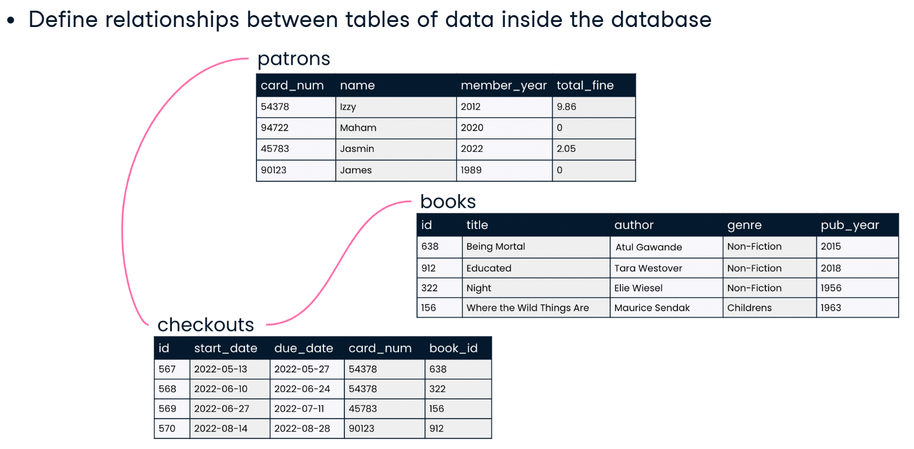
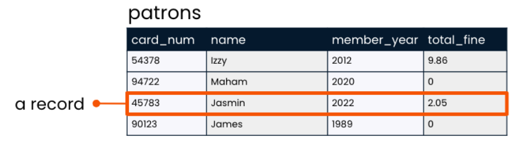

A database stores data. Let's imagine that we are in charge of storing and organizing data for a library. We might set up a database that holds information such as the data pictured here on patrons, books, and checkouts. This information is housed in objects called tables, with data organized into rows and columns. This database contains a patrons table, a books table, and a checkouts table.
A relational database defines relationships between tables of data inside the database. For example, each of our library patrons might each be associated with several checkouts. Through these relationships, we can draw conclusions about data housed in separate tables in the same database, and answer questions such as "Which books did James check out during 2022?" or "Which books are checked out most often?"

These tables might look similar to the way data is organized in spreadsheet applications such as Excel or Google Sheets, but databases are far more powerful than spreadsheets. Databases can store much more data, and storage is more secure due to encryption.
Possibly the biggest advantage of a database is that many users can write queries to gather insights from the data at the same time.

### Tables

Tables are organized into rows and columns; in the world of databases, rows are often referred to as records and columns as fields. A table's fields are limited to those set when the database was created, but the number of rows is unlimited.
Table names should be lowercase and should not include spaces - we use underscores in place of spaces. And ideally, a table name would refer to a collective group (like "inventory") but it's also okay for the table to have a plural name (such as "products").

A **record** is a row in a table. It holds data on an individual observation. Taking a look at the patrons table, we see that the table has four records: one for each of the patrons.

A **field** is a column in a table. It holds one piece of information about all observations in the table. The "name" field in the patrons table lists all of the names of our library patrons.
Because field names must be typed out when querying a database with SQL, field naming is important: 
- Should be lowercase and should not involve spaces.
- A field name should be singular rather than plural.
- Two fields in a table cannot have the same name.
- Should never share a name with the table they are housed in so that it's clear in all cases whether a field or table is being referred to.

==A **unique identifier**, sometimes called a "**key**,"== is a unique value which identifies a record so that it can be distinguished from other records in the same table. This value is very often a number.
In the patrons table, it makes sense to use the card_num field as the unique identifier for each patron, not the name field, because it's possible that as our little library grows, two patrons might have the same name.

Having more tables, each with a clearly marked subject, is generally better than having fewer tables where information about multiple subjects is combined.
Now, here's what our patrons and checkouts tables would look like if we tried to combine them. It's the same data, but much less clear because it now contains duplicate information.
While we can see that Izzy has two checkouts and Maham has none, the card_num column is no longer unique because of Izzy's multiple checkouts.

***Table topics should remain separate***.

### Data

When a table is created, a data type must be indicated for each field. The data type is chosen based on the type of data that the field will hold - a number, text, or a date for example.
-  First, different types of data are stored differently and take up different amounts of storage space.
- Second, some operations only apply to certain data types. It makes sense to multiply a number by another number, but it does not make sense to multiply text by other text for example.

- **Strings:** In programming, a "string" refers to a sequence of characters such as letters or punctuation. Some string data types can only hold short strings, such as a string up to 250 characters. Storing short strings in a small data type like this saves storage space. SQL's VARCHAR data type is more flexible and can store small or large strings
- **Integers:** store whole numbers, such as the years in the member_year column of the patrons table. SQL offers a few different data types for storing integers, depending on how big the numbers we'd like to store are. INT, a common SQL integer data type, can store numbers from less than negative two billion to more than positive two billion.
- **Floats:** store numbers that include a fractional part, such as the 2.05. SQL also offers several float data types depending on how many digits the numbers in the field are expected to be. The NUMERIC data type can store floats which have up to 38 digits total.

**==Schemas==** are often referred to as "blueprints" of databases. A schema shows a database's design, such as what tables are included in the database and any relationships between its tables. A schema also lets the reader know what data type each field can hold.
The schema for our library database shows the VARCHAR data type is used for strings like book title, author, and genre. We can also see that the patrons table is related to the checkouts table, but not the books table.

