## Defining relationships
Joining data is an essential skill which enables us to draw information from separate tables together into a single, meaningful set of results.

- One-to-many relationship.  This is the most common type of relationship, one where a single entity can be associated with several entities. Think about a music library. One artist can produce many songs over their career. This is a one-to-many relationship. In the table schema shown, each of her works are stored in the books table, and can be merged with the authors table using author_id from both tables.
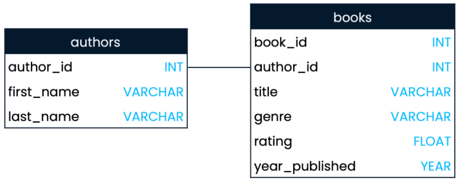

- One-to-one relationships imply unique pairings between entities and are therefore less common. A commonly held premise of forensic science is that no two fingerprints are identical, and therefore that a particular fingerprint can only be generated by one person. This is an example of a one-to-one relationship: one fingerprint for one finger.

  `Note here that although an individual will have four fingerprints stored in the fingerprints table, this is not a one-to-many relationship. It is a one-to-one relationship, because a single individual - represented as one record on the individuals table - will have one set of fingerprints - represented as one record on the fingerprints table. The four different fingerprints are four different fields in each record.`
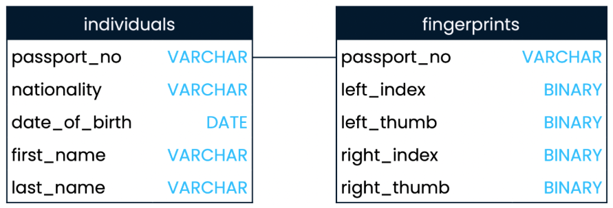

- Many-to-many relationships. An example of this is languages and countries. Here we show the official languages of Germany, Belgium and the Netherlands, where we see that many languages can be spoken in many countries.
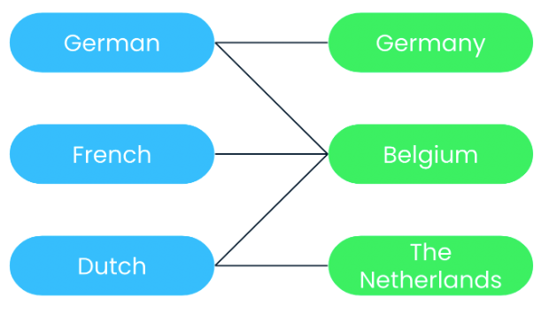

## INNER JOIN

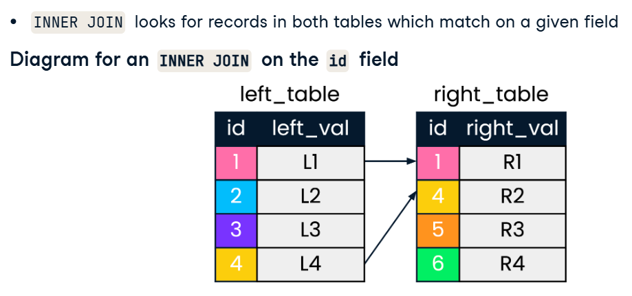

Suppose that we're interested in countries that have both a president and prime minister. In these small tables, we might notice that Egypt, Portugal, Pakistan and India appear in both tables. For larger tables though, it's not as feasible to identify these records by visual inspection. Here's where SQL joins can be helpful.

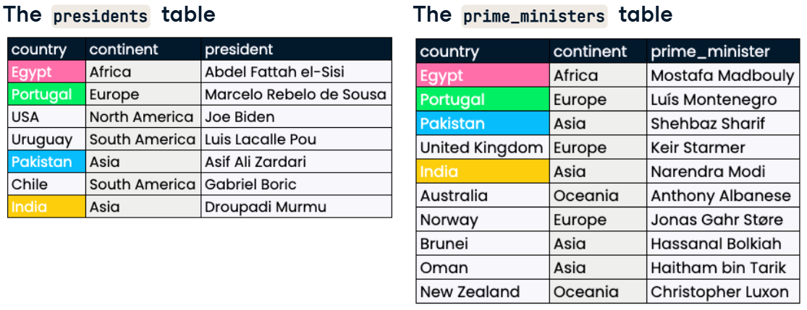

It is common to begin constructing the query with the join first, and selecting fields later. After FROM, we list the left table, followed by the INNER JOIN keyword and the right table. We then specify the field to match the tables on, using the ON keyword. Here, we use the "country" field. Lastly, we add SELECT at the start of the query and choose the fields we want returned.

`When selecting columns that exist in both tables, such as "country" and "continent", the table-dot-column_name format must be used to avoid a SQL error.`
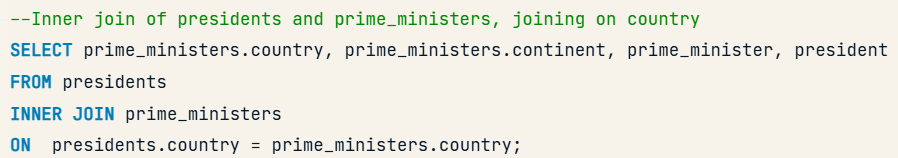

In our INNER JOIN, we've had to type out "president" and "prime_minister" several times. Luckily, we can alias table names using the same AS keyword used to alias column names. Here, we use aliases p1 and p2 in both our SELECT and ON clauses to shorten our query.
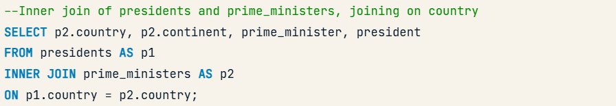

When joining on two identical column names, we can employ the USING command followed by the shared column name in parentheses. Here, since the join field is named "country" in both tables, we can use USING.
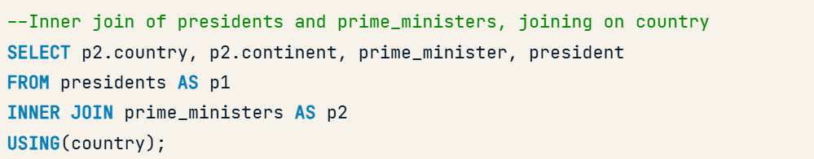

## Multiple joins

A powerful feature of SQL is that multiple joins can be combined and run in a single query.
We begin with the same INNER JOIN as before, and then chain another INNER JOIN to the result of our first INNER JOIN. 

We can continue the chain and join as many tables together as we need!

We can limit the records returned by supplying an additional field to join on by adding the AND keyword to our ON clause. In this example, we join on date, a frequently used second column when joining on multiple fields. The result set now contains records that match on both id AND date.

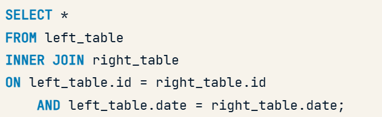

## LEFT and RIGHT joins
Outer joins can obtain records from other tables, even if matches are not found for the field being joined on.
### LEFT JOIN
 Will return all records in the left_table, and those records in the right_table that match on the joining field provided.  Whereas LEFT JOIN keeps all records in left_table, as well as null values for right_val where is no match in right_table. Note that ids 5 and 6 in right_table do not feature in LEFT JOIN in any way.

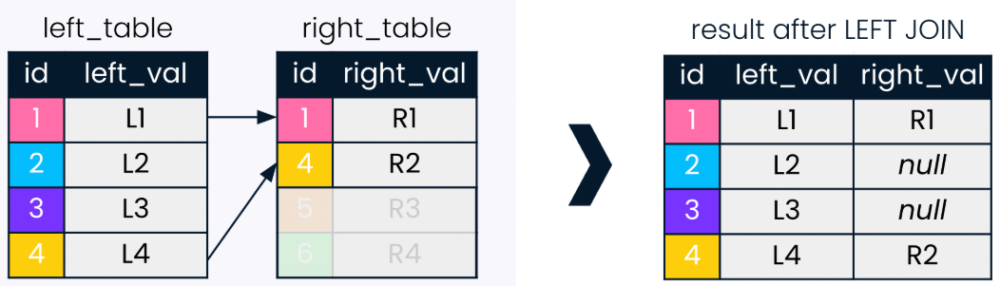

Say we want our query to include all countries with prime ministers, presidents if they happen to have them, and missing values if they don't. The first three records in the result are the same as they were with an INNER JOIN, but from the fourth record the result starts to look different. Since the United Kingdom does not have a president, a corresponding null value is returned in the president field.

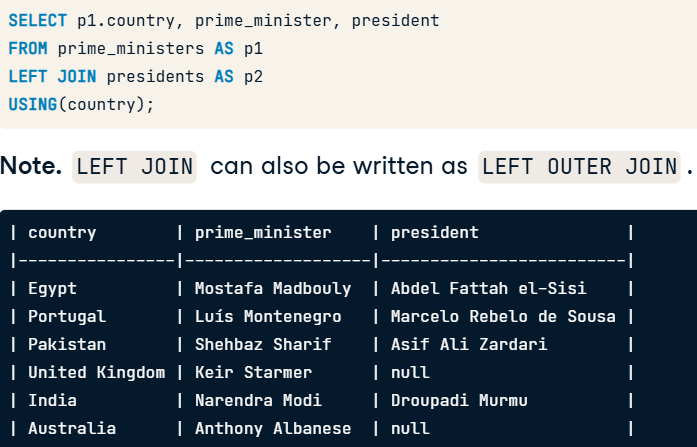

### RIGHT JOIN
RIGHT JOIN is the second type of outer join, and is much less common than LEFT JOIN. 
Instead of matching entries in the id column of the left table to the id column of the right table, a RIGHT JOIN does the reverse. All records are retained from right_table, even when id doesn't find a corresponding match in left_table. Null values are returned for the left_value field in records that do not find a match.

We perform a right join of prime_ministers on the left and presidents on the right. The only change is from the LEFT JOIN keyword to RIGHT JOIN. The result contains null values where countries have presidents but no prime ministers.

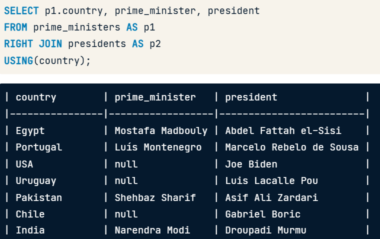

### FULL JOIN
A FULL JOIN combines a LEFT JOIN and a RIGHT JOIN. As you can see in this diagram, no values are faded out as they were in earlier diagrams. This is because the FULL JOIN will return all ids, irrespective of whether they have a match in the other table being joined.

`Note that this time, nulls can appear in either left_value or right_value fields.`

Suppose we were interested in all the countries in our database, and wanted to check whether they had a president, a prime minister, or both. We'll walk through the code line by line to do this using a FULL JOIN.

`Note that order of the tables matters here, and if we switched the order, the records would be ordered differently depending on how prime ministers and presidents are ordered in the tables.`

We chose a FULL JOIN because we were interested in all countries, whether they had a prime minister, a president, or both.

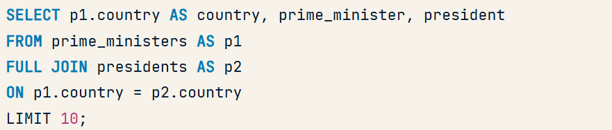

### CROSS JOIN
CROSS JOINs are slightly different than joins we have seen previously: they create all possible combinations of two tables.
In this diagram we have two tables named table1 and table2, with one field each: id1 and id2, respectively. The result of the CROSS JOIN is all nine combinations of the id values of 1, 2, and 3 in table1 with the id values of A, B, and C for table2.

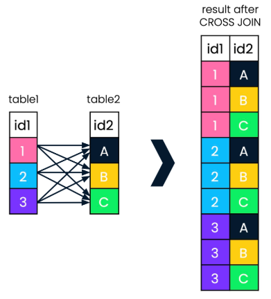

Suppose that all prime ministers in Asia from our database are scheduled for individual meetings with all presidents in South America from our database, and we are journalists who wish to follow all the meetings that will happen.
We use a WHERE clause to focus only on prime ministers from Asia and presidents from South America. The results of the query give us all possible pairings of the four prime ministers from Asia in the prime_ministers table, and the two presidents from South America in the presidents table.

`Note that the syntax is very minimal, and we do not specify ON or USING with CROSS JOIN.`

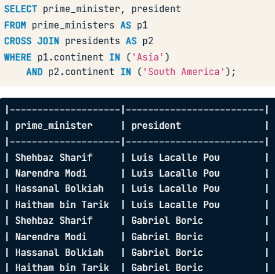

### SELF JOIN
Joining a table to itself may seem like an unusual thing to do. Why would we want to do that? Self joins are used to compare values from part of a table to other values from within the same table.

We can't just write SELF JOIN in SQL code, for example. In addition, aliasing is required for a self join.
Let's look at a chunk of INNER JOIN code using the prime_ministers table. The country column is selected twice, and so is the continent column. The prime_ministers table is on both the left and the right of the JOIN, making this both a self join and an INNER JOIN!
The vital step here is setting the joining fields which we use to match the table to itself. For each country, we will find multiple matched countries in the right table, since we are joining on continent. Each of these matched countries will be returned as pairs. Since this query will return several records, we use LIMIT to return only the first 10 records.

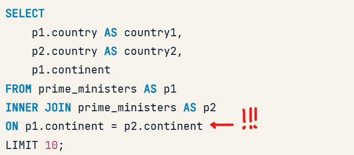

The results are a pairing of each country with every other country in the same continent. However, note that our join also paired countries with themselves, since they too are in the same continent as themselves.

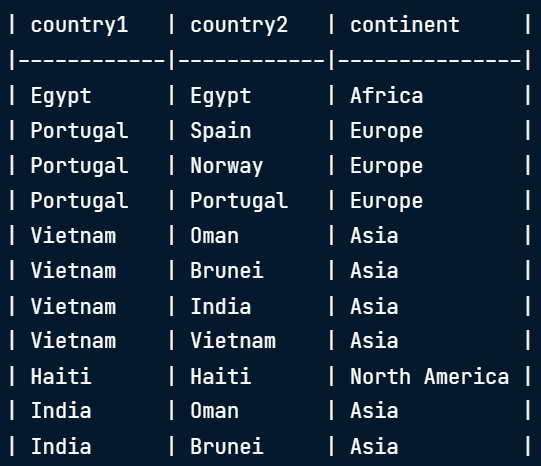

To fix this, recall the use of the AND clause to ensure multiple conditions are met in the ON clause. In our second condition, we use the not equal to operator (`<>`, `NOT EQUAL` or `!=`) to exclude records where the p1-dot-country and p2-dot-country fields are identical.

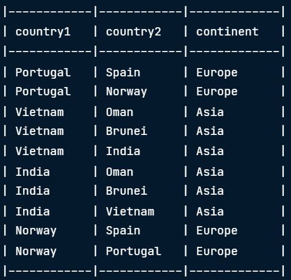

## Set theory for SQL joins
SQL has three main set operations, UNION, INTERSECT and EXCEPT. We can think of each circle as representing a table. The green parts represent what is included after the set operation is performed on each pair of tables.
For all set operations, the number of selected columns and their respective data types must be identical. For instance, we can't stack a number field on top of a character field.
The result will only use field names (or aliases, if used) of the first SELECT statement in the query.

### UNION
In SQL, the UNION operator takes two tables as input, and returns all records from both tables. If two records are identical, UNION only returns them once.
In SQL, there is a further operator for unions called UNION ALL. It will include duplicate records.

We perform a SELECT statement on our first table, a SELECT statement on our second table, and specify a set operation (in this example, either UNION or UNION ALL) between them.

`Note that set operations do not require a field to join ON.`

### INTERSECT
INTERSECT takes two tables as input, and returns only the records that exist in both tables.

We perform a SELECT statement on our first table, a SELECT statement on our second table, and specify our set operator between them.
Similar to UNION, for a record to be returned, INTERSECT requires all fields to match, since in set operations we do not specify any fields to match on.
In INNER JOIN, similar to INTERSECT, only results where both fields match are returned. INNER JOIN will return duplicate values, whereas INTERSECT will only return common records once.

### EXCEPT
EXCEPT allows us to identify the records that are present in one table, but not the other. More specifically, it retains only records from the left table that are not present in the right table.

`Note that while the id 4 does exist in the right_table, the whole record does not match, which is why the last record of left_table is not faded out.`

Let's say we were interested in monarchs that do NOT also hold the title of prime minister. The EXCEPT clause is really handy for this! The SQL code shown selects the monarch and country field from monarchs and then looks for common entries in the prime_minister and country fields in the prime_ministers table, looking to exclude those entries. In the result, we see only the three monarchs from our leaders database who **do not** also serve the role of prime minister.

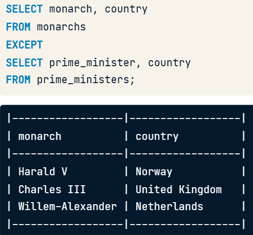

## Subqueries

### Inside WHERE
This is called a subquery! It chooses records in the first table where the country matches the list returned by our subquery. Since Spain does not have a president, only the Portuguese president is listed.

Subqueries in the WHERE clause are used to filter rows in the main query based on the results of another query. They typically return a single value or a list of values.
Advantages:
 - Advanced filtering: They allow you to filter data based on dynamically calculated or related values.
 - Efficiency: Ideal for comparing rows with computed or aggregated data.
 - Simplicity: Intuitive when you need to filter using a single value or a list.

How might we adapt our semi join to determine countries in the Americas founded after 1800? To change our semi join from before to after 1800, we add NOT before the IN statement.
We add to our first WHERE clause to filter for continents in the Americas. The result shows presidents of countries in the Americas that gained independence after 1800.

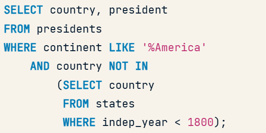

`Note: notice how the select in the sub query is the same **TYPE** as the one in the where clause from the parent query`

Subqueries inside WHERE can be from the same table or from a different table, and here, the subquery is from a different table.
The WHERE clause is the most common place for subqueries, because filtering data is one of the most common data manipulation tasks.

### Inside SELECT
The second most common type of subquery is inside a SELECT clause.

Subqueries in the SELECT clause calculate additional values for each row in the main query. They generally return a single value per row.
Advantages:
 - Dynamic calculations: They allow you to add derived columns based on related information.
 - Flexibility: Complement each row with computed values without requiring multiple JOINs.
 - Simplicity: Easier to read than complex joins when fetching derived or related data.

Our subquery requires two things. First, it needs to COUNT all monarchs. Second, it needs a WHERE statement matching the continent fields in the two tables. This subquery follows the selection of DISTINCT continents, and will therefore count all monarchs within them in the SELECT statement. A subquery inside a SELECT statement like this requires an alias, like monarch_count here.

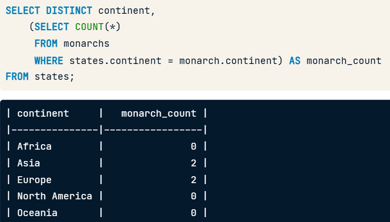

Interesting Query, note the operation performed using the subquery result.

Important, this was tricky for me.

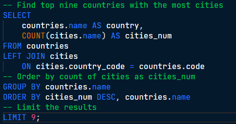

`Note how I had to Group by the countries.name before doing the order by, why? because I need to work with numbers, in this case the aggregate function from the select COUNT(cities.name)`

Here is the same query as before but leveraging subqueries!

### Inside FROM
The last type of subquery we'll cover is a query inside a FROM clause.

Subqueries in the FROM clause act as temporary tables. They allow the results of one query to be used as the base for the main query.
Advantages:
 - Data reuse: You can calculate intermediate results and treat them as if they were a table.
 - Clarity: Useful for breaking down complex problems into manageable parts.
 - Advanced aggregation: Great for performing complex calculations or nested queries.

We haven't seen yet that we can include multiple tables in a FROM clause by adding a comma between them. In the SQL syntax shown, we include two different tables, left_table and right_table, in our FROM clause.

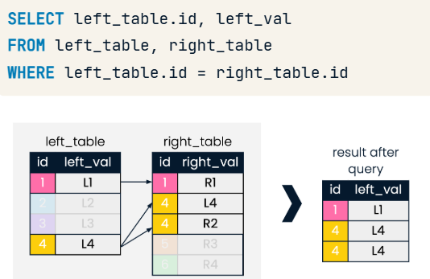

We can drop duplicates using the DISTINCT command in the query shown.

#### Example
We can nest the subquery we initially wrote into a FROM statement, so that we are selecting from both monarchs and our subquery, aliased as "sub".
We also use the WHERE clause as before to identify records in both tables that match on continent.
As we saw on the previous slide, because the continents from our subquery will find multiple matches in monarchs, this match will return duplicates.
As before, in our SELECT statement, we use the DISTINCT command to drop duplicate continents, and select sub.most_recent to get the most recent independence year for each continent.
Lastly, we ORDER BY continent.

There we have it: the continents with monarchs in our database, and the most recent year of independence in those continents.

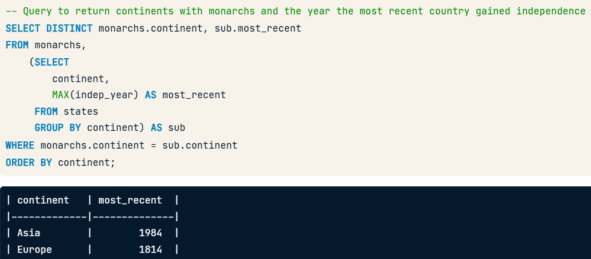

## Final challenge result!

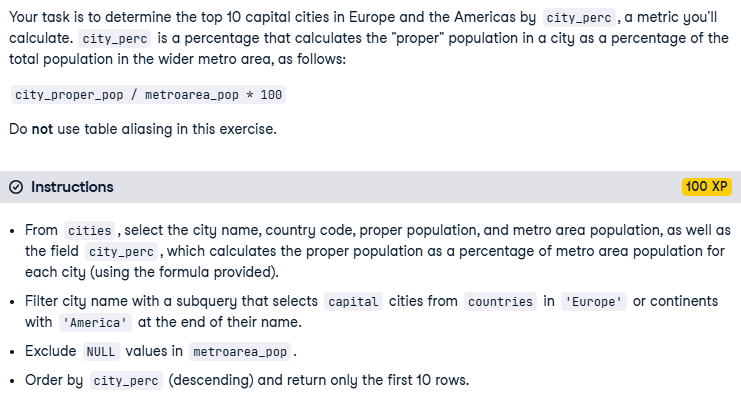
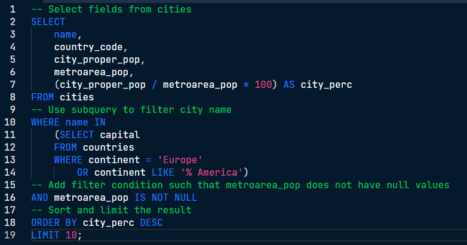