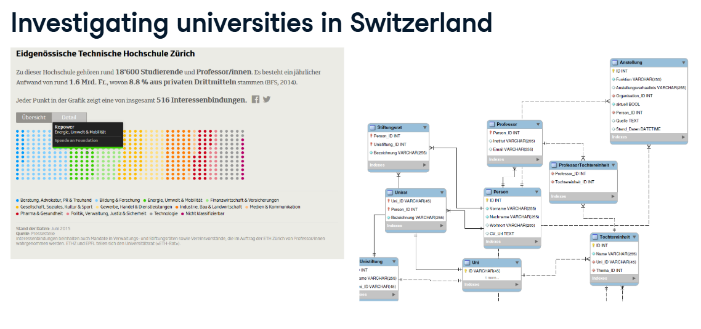
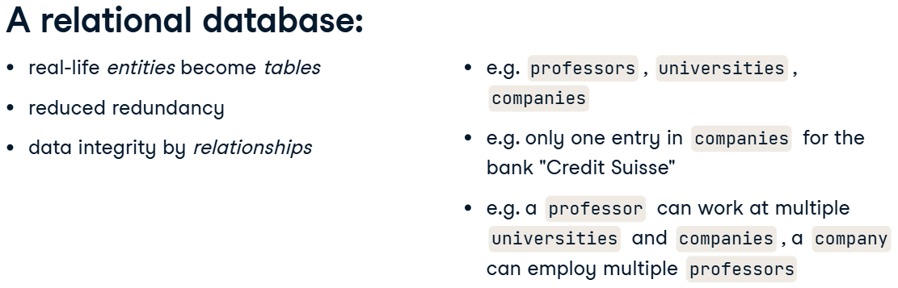

# Intro to Relational Databases in SQL

Let me tell you a little story first. As a data journalist, I try to uncover corruption, misconduct and other newsworthy stuff with data. A couple of years ago I researched secondary employment of Swiss university professors. It turns out a lot of them have more than one side job besides their university duty, being paid by big companies like banks and insurances. So I discovered more than 1500 external employments and visualized them in an interactive graphic, shown on the left. For this story, I had to compile data from various sources with varying quality. Also, I had to account for certain specialties, for example, that a professor can work for different universities; or that a third-party company can have multiple professors working for them. In order to analyze the data, I needed to make sure its quality was good and stayed good throughout the process. That's why I stored my data in a database, whose quite complex design you can see in the right graphic. All these rectangles were turned into database tables.

But why did I use a database?

Throughout this course, you will actually work with the same real-life data used during my investigation. You'll start from a single table of data and build a full-blown relational database from it, column by column, table by table.
By doing so, you'll get to know constraints, keys, and referential integrity. These three concepts help preserve data quality in databases.
By the end of the course, you'll know how to use them. In order to get going, you'll just need a basic understanding of SQL – which can also be used to build and maintain databases, not just for querying data.

