# Intro to Relational Databases in SQL

Let me tell you a little story first. As a data journalist, I try to uncover corruption, misconduct and other newsworthy stuff with data. A couple of years ago I researched secondary employment of Swiss university professors. It turns out a lot of them have more than one side job besides their university duty, being paid by big companies like banks and insurances. So I discovered more than 1500 external employments and visualized them in an interactive graphic, shown on the left. For this story, I had to compile data from various sources with varying quality. Also, I had to account for certain specialties, for example, that a professor can work for different universities; or that a third-party company can have multiple professors working for them. In order to analyze the data, I needed to make sure its quality was good and stayed good throughout the process. That's why I stored my data in a database, whose quite complex design you can see in the right graphic. All these rectangles were turned into database tables.

But why did I use a database?

Throughout this course, you will actually work with the same real-life data used during my investigation. You'll start from a single table of data and build a full-blown relational database from it, column by column, table by table.
By doing so, you'll get to know constraints, keys, and referential integrity. These three concepts help preserve data quality in databases.
By the end of the course, you'll know how to use them. In order to get going, you'll just need a basic understanding of SQL – which can also be used to build and maintain databases, not just for querying data.

## Create Table

At the minimum, this command requires a table name and one or more columns with their respective data types.
 The table name is the name of the table you want to create. The column names and data types are the names and data types of the columns you want to create in the table.

 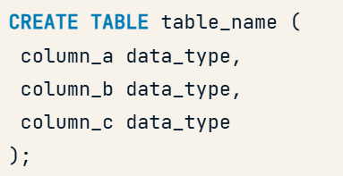

 For example, you could create a "weather" table with three aptly named columns. After each column name, you must specify the data type. There are many different types, and you will discover some in the remainder of this course. For example, you could specify a text column, a numeric column, and a column that requires fixed-length character strings with 5 characters each.

 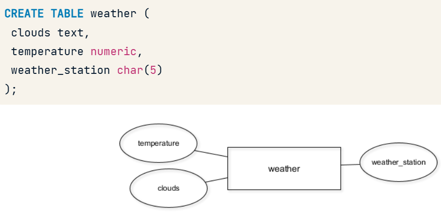

 Oops! We forgot to add the university_shortname column to the professors table.
 However, adding columns to existing tables is easy, especially if they're still empty.
 To add columns you can use the following SQL query:

 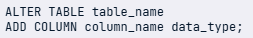

 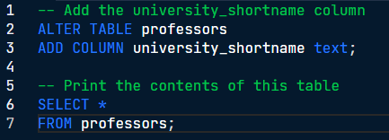

 ## Migrate data between tables

 Here's the current entity-relationship diagram, showing the five tables.

 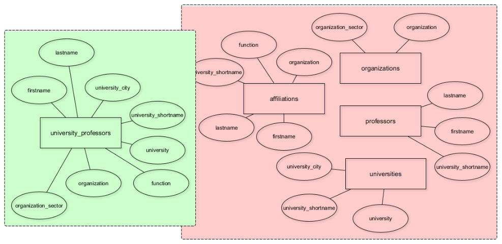

 At this moment, only the "university_professors" table holds data. The other four, shown in red, are still empty.

 You will migrate data from the green part of this diagram to the red part, moving the respective entity types to their appropriate tables. In the end, you'll be able to delete the "university_professors" table.

 One advantage of splitting up "university_professors" into several tables is the reduced redundancy. As of now, "university_professors" holds 1377 entries. However, there are only 1287 distinct organizations. 
 Therefore, you only need to store 1287 distinct organizations in the new "organizations" table.

### INSERT DISTINCT records INTO the new tables
 In order to copy data from an existing table to a new one, you can use the "INSERT INTO SELECT DISTINCT" pattern.

 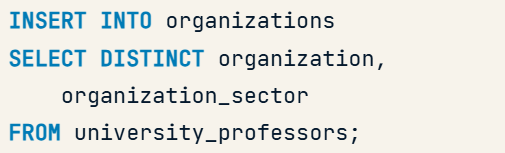

After "INSERT INTO", you specify the name of the target table – "organizations" in this case. Then you select the columns that should be copied over from the source table – "unviversity_professors" in this case. You use the "DISTINCT" keyword to only copy over distinct organizations.

`If you just used "INSERT INTO SELECT", without the "DISTINCT" keyword, duplicate records would be copied over as well.`

### The INSERT INTO statement
This is the normal use case for "INSERT INTO" – where you insert values manually.

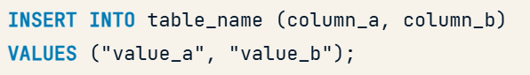

"INSERT INTO" is followed by the table name and an optional list of columns which should be filled with data. Then follows the "VALUES" keyword and the actual values you want to insert.

### RENAME a COLUMN

Unfortunately, I made a mistake in this process. Can you spot it? The way the "organisation" column is spelled is not consistent with the American-style spelling of this table, using an "s" instead of a "z".

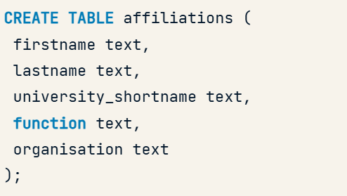

You will correct this with the known "ALTER TABLE" syntax.
You do this with the RENAME COLUMN command by specifying the old column name first and then the new column name, i.e., "RENAME COLUMN old_name TO new_name".

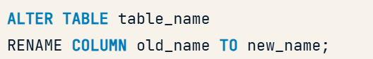

### DROP a COLUMN

The syntax for this is again very simple, you use a "DROP COLUMN" command followed by the name of the column. Dropping columns is straightforward when the tables are still empty, so it's not too late to fix this error.

But why is it an error in the first place?

Well, I queried the "university_professors" table and saw that there are 551 unique combinations of first names, last names, and associated universities. I then queried the table again and only looked for unique combinations of first and last names. Turns out, this is also 551 records. This means that the columns "firstname" and "lastname" uniquely identify a professor.

So the "university_shortname" column is not needed in order to reference a professor in the affiliations table.

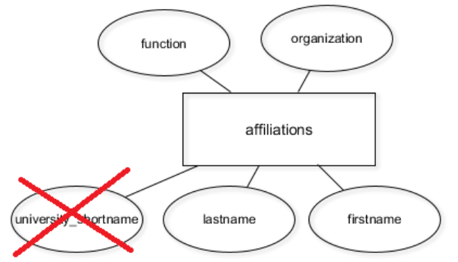

You can remove it, and this will reduce the redundancy in your database again. In other words: The columns "firstname", "lastname", "function", and "organization" are enough to store the affiliation a professor has with a certain organization.

### DROP a TABLE

You can also drop tables. This is done with the "DROP TABLE" command followed by the name of the table. This will delete the table and all of its contents from the database. This is a permanent action and cannot be undone.

## Database Constraints

The idea of a database is to push data into a certain structure – a pre-defined model, where you enforce data types, relationships, and other rules. Generally, these rules are called integrity constraints, although different names exist.

Integrity constraints can roughly be divided into three types:
- Attribute contraints, e.g.; a certain attribute, represented through a database column, could have the integer data type, allowing only for integers to be stored in this column.
- Key constraints, e.g.; Primary keys, for example, uniquely identify each record, or row, of a database table.
- Referential integrity constraints. In short, they glue different database tables together.

### Attribute constraints / Data types

In its simplest form, attribute constraints are data types that can be specified for each column of a table.

There are basic data types for numbers, such as "bigint", or strings of characters, such as "character varying". There are also more high-level data types like "cidr", which can be used for IP addresses. Implementing such a type on a column would disallow anything that doesn't fit the structure of an IP.

Data types also restrict possible SQL operations on the stored data. For example, it is impossible to calculate a product from an integer *and* a text column, as shown here in the example.

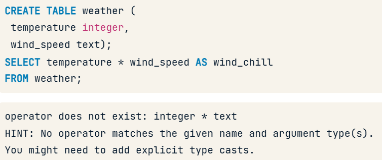

The solution for this is type casts, that is, on-the-fly type conversions. In this case, you can use the "CAST" function, followed by the column name, the AS keyword, and the desired data type, and PostgreSQL will turn "wind_speed" into an integer right before the calculation.

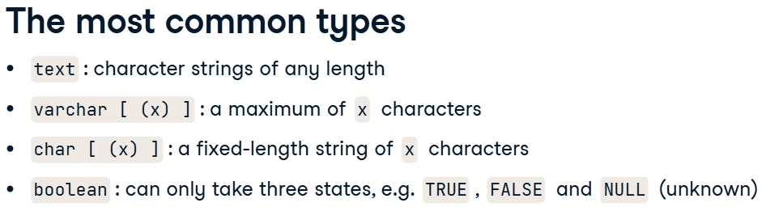
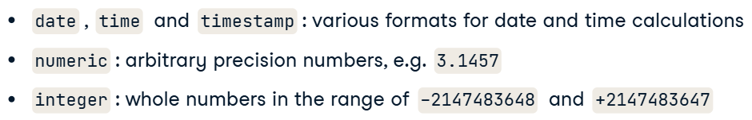

Altering types after table creation is also straightforward, just use the shown "ALTER TABLE ALTER COLUMN" statement.

Sometimes it may be necessary to truncate column values or transform them in any other way, so they fit with the new data type. Then you can use the "USING" keyword, and specify a transformation that should happen before the type is altered.

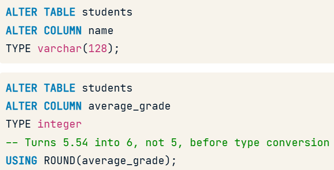

#### NULL
"NULL" can mean a couple of things, for example, that the value is unknown, or does not exist at all. It can also be possible that a value does not apply to the column.

`Comparing "NULL" with "NULL" always results in a "FALSE" value.`

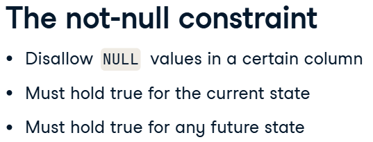
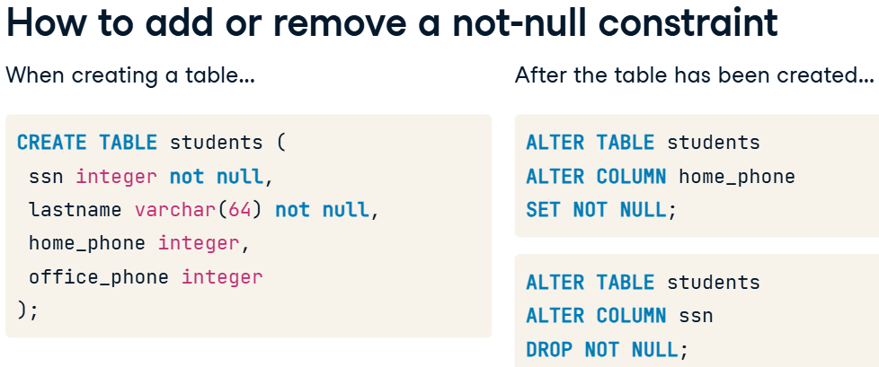

#### UNIQUE
The unique constraint on a column makes sure that there are no duplicates in a column. So any given value in a column can only exist once.

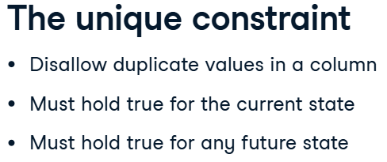
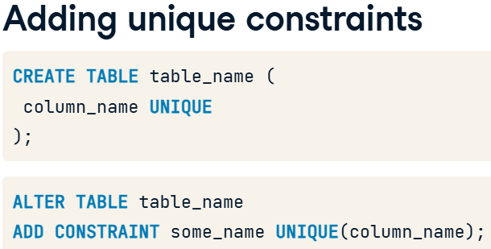

### Keys and Superkeys
Typically a database table has an attribute, or a combination of multiple attributes, whose values are unique across the whole table. Such attributes identify a record uniquely.

Normally, a table, as a whole, only contains unique records, meaning that the combination of all attributes is a key in itself. However, it's not called a key, but a superkey, if attributes from that combination can be removed, and the attributes still uniquely identify records.
If all possible attributes have been removed but the records are still uniquely identifiable by the remaining attributes, we speak of a minimal superkey.
This is the actual key. So a key is always minimal.

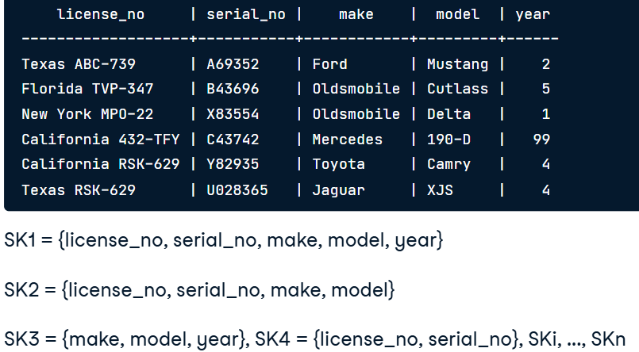
The table shows six different cars, so the combination of all attributes is a superkey. If we remove the "year" attribute from the superkey, the six records are still unique, so it's still a superkey.

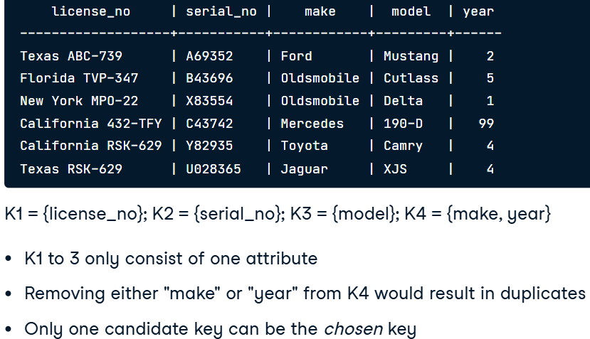
However, there are only four minimal superkeys, and these are "license_no", "serial_no", and "model", as well as the combination of "make" and "year".

These four minimal superkeys are also called candidate keys. In the end, there can only be one key for the table, which has to be chosen from the candidates.

#### Primary keys
Primary keys are one of the most important concepts in database design. Almost every database table should have a primary key – chosen by you from the set of candidate keys.

The main purpose, as already explained, is uniquely identifying records in a table. This makes it easier to reference these records from other tables.

Primary keys need to be defined on columns that don't accept duplicate or null values. Lastly, primary key constraints are time-invariant, meaning that they must hold for the current data in the table – but also for any future data that the table might hold. It is therefore wise to choose columns where values will always be unique and not null.

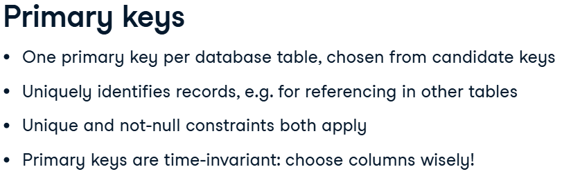

`Ideally, though, primary keys consist of as few columns as possible!`

These two tables accept exactly the same data, however, the latter has an explicit primary key specified.

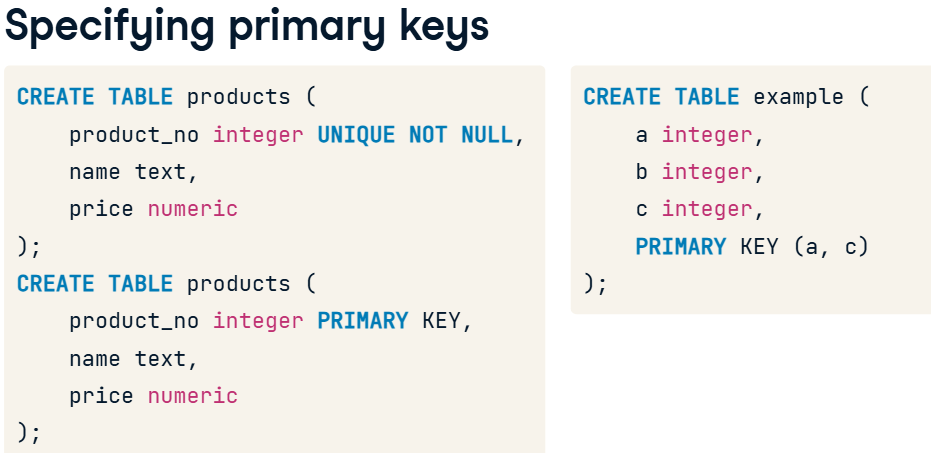

Adding primary key constraints to existing tables is the same procedure as adding unique constraints. As with unique constraints, you have to give the constraint a certain name.

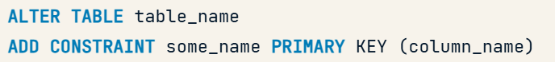

#### Surrogate keys
Surrogate keys are sort of an artificial primary key. In other words, they are not based on a native column in your data, but on a column that just exists for the sake of having a primary key.

If you define an artificial primary key, ideally consisting of a unique number or string, you can be sure that this number stays the same for each record. Other attributes might change, but the primary key always has the same value for a given record.

There's a special data type in PostgreSQL that allows the addition of auto-incrementing numbers to an existing table: the "serial" type. It is specified just like any other data type. Once you add a column with the "serial" type, all the records in your table will be numbered. Whenever you add a new record to the table, it will automatically get a number that does not exist yet.

`Also, if you try to specify an ID that already exists, the primary key constraint will prevent you from doing so.`

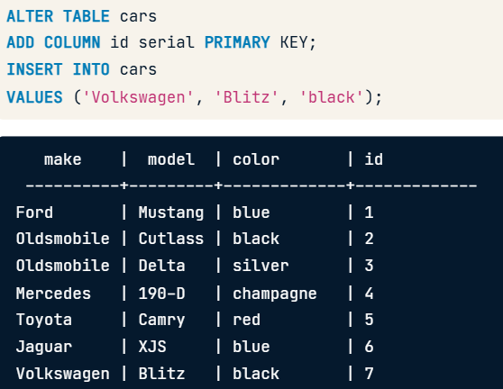

Another strategy for creating a surrogate key is to combine two existing columns into a new one. In this example, we first add a new column with the "varchar" data type. We then "UPDATE" that column with the concatenation of two existing columns. The "CONCAT" function glues together the values of two or more existing columns. Lastly, we turn that new column into a surrogate primary key.

`I personally would try to not use this method`

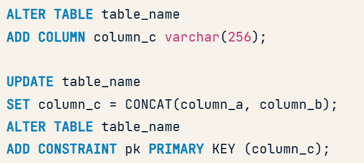

