# Database Design

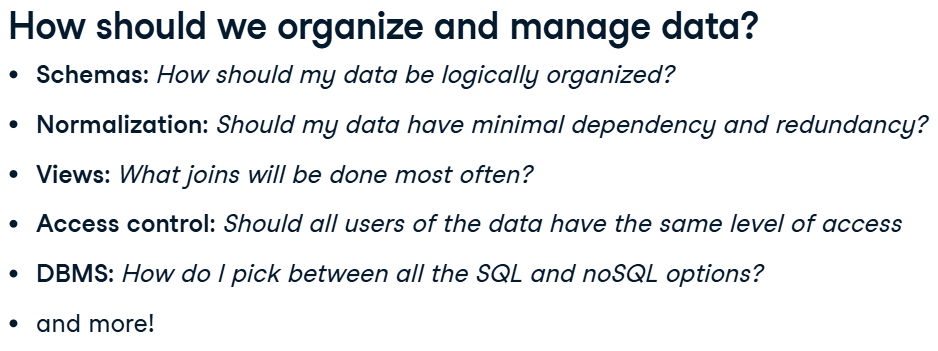

## OLTP and OLAP
OLTP and OLAP are approaches to processing data, and they will be referenced throughout this course.
They help define the way data is going to flow, be structured, and stored.

OLTP stands for Online **Transaction** Processing.  
OLAP stands for Online **Analytical** Processing.

`As the names hint, the OLTP approach is oriented around transactions, while the other is oriented around analytics.`

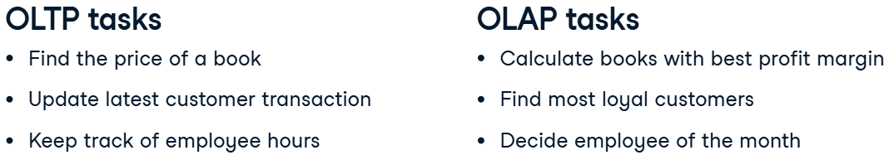

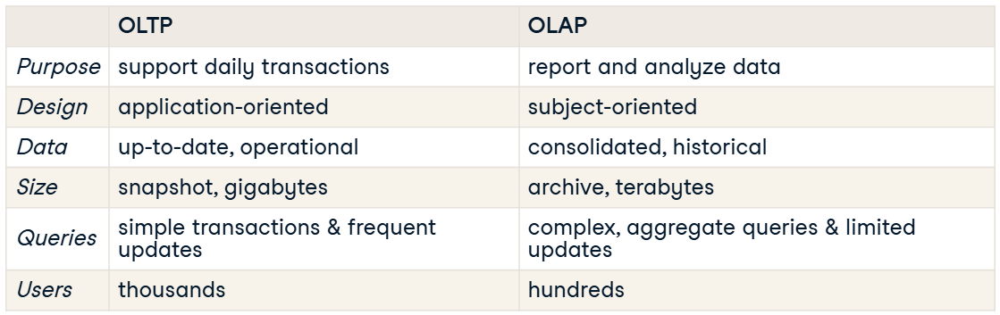

OLAP and OLTP systems work together; in fact, they need each other. OLTP data is usually stored in an operational database that is 
pulled and cleaned to create an OLAP data warehouse.

Without transactional data, no analyses can be done in the first place. Analyses from OLAP systems are used to inform business 
practices and day-to-day activity, thereby influencing the OLTP databases.

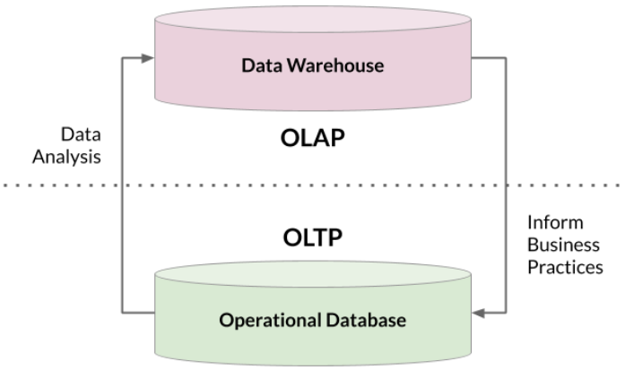

## Storing Data
Data can be stored in three different levels.

1. Structured data, which is usually defined by schemas. Data types and tables are not only defined, but relationships between tables are also defined, using concepts like foreign keys.
2. Unstructured data, which is schemaless and data in its rawest form, meaning it's not clean. Most data in the world is unstructured. Examples include media files and raw text.
3. Semi-structured data, which does not follow a larger schema, rather it has an ad-hoc self-describing structure. Therefore, it has some structure. This is an inherently vague definition as there can be a lot of variation between structured and unstructured data. Examples include NoSQL, XML, and JSON.

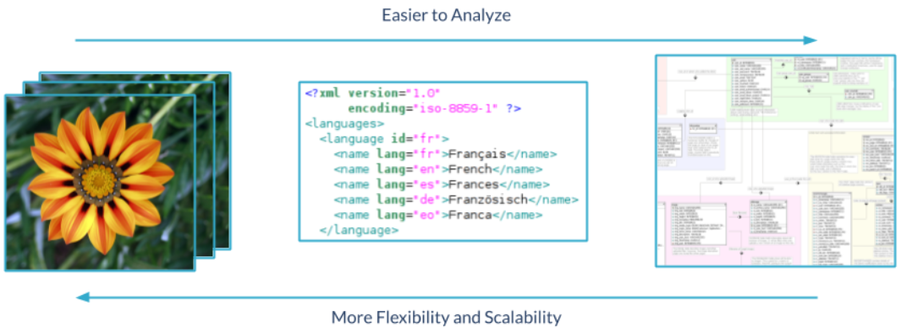

`Because its clean and organized, structured data is easier to analyze. However, it's not as flexible because it needs to follow a schema, which makes it less scalable. These are trade-offs to consider as you move between structured and unstructured data.`

- Operational databases, which are used for OLTP, are an example of **traditional databases** (SQL). Decades ago, traditional databases used to be enough for data storage.
- Then as data analytics took off, **data warehouses** were popularized for OLAP approaches.
- And, now in the age of *big data*, we need to analyze and store even more data, which is where the **data lake** comes in.

### Data warehouses
- Data warehouses are optimized for read-only analytics. 
- They combine data from multiple sources and use massively parallel processing for faster queries (**MPP**).
- In their database design, they typically use **dimensional modeling** and a **denormalized schema**.
- Amazon, Google, and Microsoft all offer data warehouse solutions, known as Redshift, Big Query, and Azure SQL Data Warehouse, respectively.
- A **data mart** is a subset of a data warehouse dedicated to a specific topic. Data marts allow departments to have easier access to the data that matters to them.

### Data lakes
Technically, traditional databases and warehouses can store unstructured data, but **not** cost-effectively.  

- Data Lake storage is **cheaper** because it uses **object storage** as opposed to the traditional block or file storage.  
- This allows massive amounts of data to be stored effectively of all types, from streaming data to operational databases.
- Lakes are massive because they store all the data that might be used (often petabytes in size).
- Lakes are **schema-on-read**, meaning the schema is created as data is read (Warehouses and traditional databases are classified as schema-on-write because the schema is predefined).
- Data lakes have to be organized and cataloged well; otherwise, it becomes an aptly named "data swamp."
- Data lakes aren't only limited to storage. It's becoming popular to run analytics on data lakes using services such as **Apache Spark** and **Hadoop**.  
`the later is especially true for tasks like deep learning and data discovery, which needs a lot of data that doesn't need to be that "clean."`

### Thinking how data gets to us
When we think about where to store data, we have to think about how data will get there and in what form.  
**Extract Transform Load** (ETL) and **Extract Load Transform** (ELT) are two different approaches for describing data flows.

- ETL is the more traditional approach for warehousing and smaller-scale analytics. Data is transformed before loading into storage - usually to follow the storage's schema, as is the case with warehouses.
- ELT has become common with big data projects. Data is stored in its native form in a storage solution like a data lake. Portions of data are transformed for different purposes, from building a data warehouse to doing deep learning.

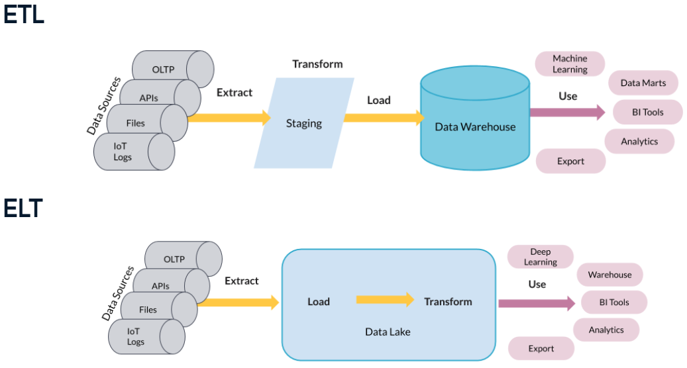

## What is DB Design?
Database design determines how data is logically stored. This is crucial because it affects how the database will be queried, whether for reading data or updating data. 
There are two important concepts to know when it comes to database design:
1. **Database models** are high-level specifications for database structure. The relational model, which is the most popular, is the model used to make relational databases. It defines rows as records and columns as attributes. It calls for rules such as each row having unique keys. There are other models that exist that do not enforce the same rules (NoSQL, object-oriented, network).
2. A **schema** is a database's blueprint. In other words, the implementation of the database model. It takes the logical structure more granularly by defining the specific tables, fields, relationships, indexes, and views a database will have. Schemas must be respected when inserting structured data into a relational database.

### Design steps
The first step to database design is **data modeling**. This is the abstract design phase, where we define a data model for the data to be stored.  
There are three levels to a data model:
1. A **conceptual** data model describes what the database contains, such as its entities, relationships, and attributes.
    - data structure diagrams (ER: entity-relational, UML: unified modeling language).
2. A **logical** data model decides how these entities and relationships map to tables.
    - db models and schemas (relational model, star schema).
3. A **physical** data model looks at how data will be physically stored at the lowest level of abstraction.
    - partitions, CPUs, indexes, backups and tablespaces.
 

#### Relational model:
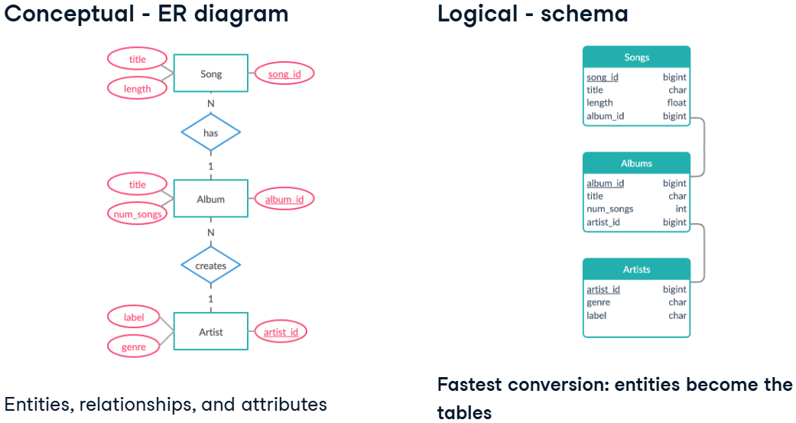

Let's look at some other ways this ER diagram could be converted.
For example, you could opt to have one table because you don't want to have to run so many *joins* to get song information.  
Or, you could add tables for genre and label. Many songs share these attributes, and having one place for them helps with data integrity. 
The biggest difference here is how the tables are determined.

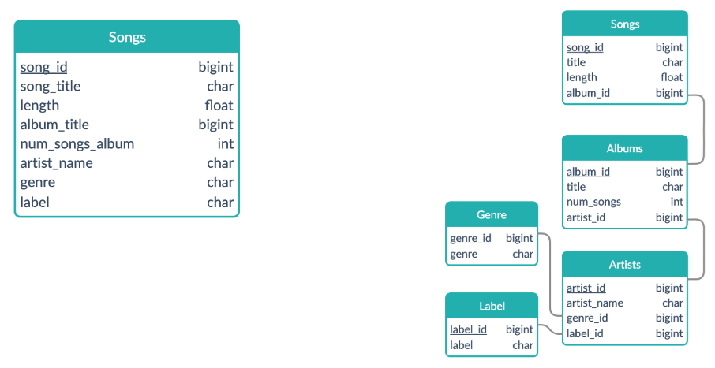
 
 

#### Dimensional model:
Dimensional modeling is an adaptation of the relational model specifically **for data warehouses**.  
It's optimized for OLAP type of queries that aim to analyze rather than update. To do this, it uses the star schema.  
It tends to be easy to interpret and extend. This is a big plus for analysts working on the warehouse.

Dimensional models are made up of two types of tables:
1. What the **fact** table holds is decided by the business use-case. It contains records of a key metric, and this metric changes often. Fact tables also hold foreign keys to dimension tables.
2. **Dimension** tables hold descriptions of specific attributes and these do not change as often.

The turquoise table is a fact table called songs. It contains foreign keys to purple dimension tables. These dimension tables expand on the attributes of a fact table, such as the album it is in and the artist who made it. The records in fact tables often change as new songs get inserted. Albums, labels, artists, and genres will be shared by more than one song - hence records in dimension tables won't change as much.

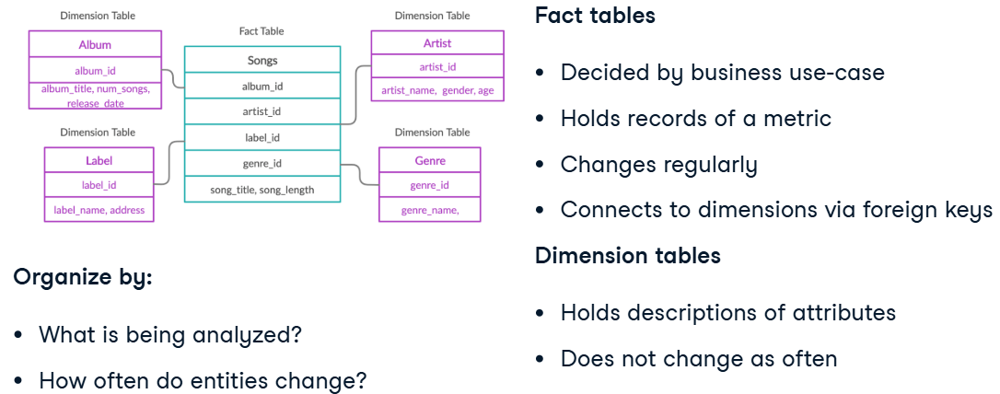

`Summing it up, to decide the fact table in a dimensional model, consider what is being analyzed and how often entities change.`
 
 

## Database Schemas and Normalization
### Star schema / Kimball
The star schema is the simplest form of the dimensional model. Some use the terms "star schema" and "dimensional model" interchangeably. 
Fact tables hold records of metrics that are described further by dimension tables.

Excluding primary and foreign keys, the fact table holds the sales amount and quantity of books. It's connected to dimension tables with details on the books sold, the time the sale took place, and the store buying the books. You may notice the lines connecting these tables have a special pattern. These lines represent a one-to-many relationship.

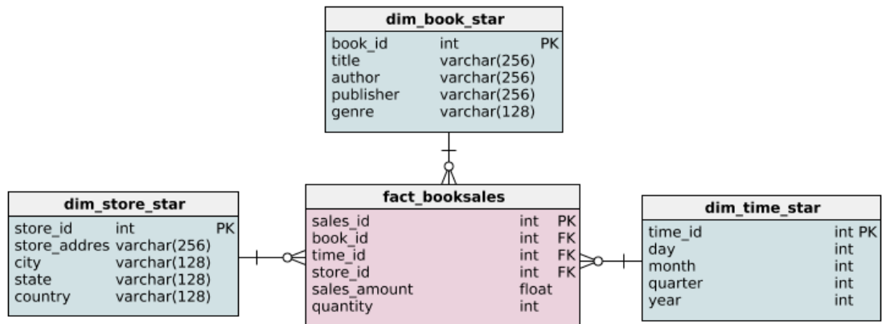
 
 

### Snowflake schema
The snowflake schema is an extension of the star schema (we see that it has more tables).  
The information contained in this schema is the same as the star schema. In fact, the fact table is the same, but the way the dimension tables are structured is different. We see that they extend more, hence it's namesake.

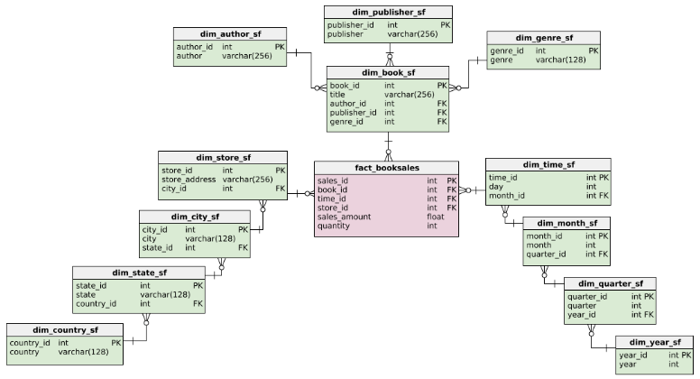

`The star schema extends one dimension, while the snowflake schema extends over more than one dimension. This is because the dimension tables are normalized.`
 
 

### Normalization
Normalization is a technique that divides tables into smaller tables and connects them via relationships. The goal is to reduce redundancy and increase data integrity (There are several forms of normalization, which we'll delve into later).  

The basic idea is to identify repeating groups of data and create new tables for them.
Here's the book dimension in the star schema. What could be repeating here? 

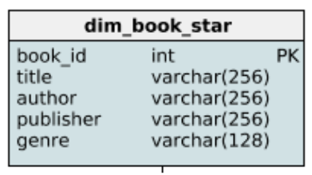

Primary keys are inherently unique. For book titles, although there is possible repeat here, it is not common. On the other hand, authors often publish more than one book, publishers definitely publish many books, and a lot of books share genres.  
 We can create new tables for them, and it results in the following snowflake schema: 
 `note how these repeating groups now have their own table`

 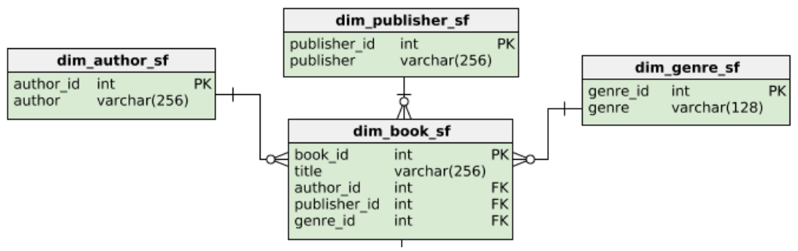
 
 

 On to the store dimension! City, states, and countries can definitely have more than one book stores within them.

 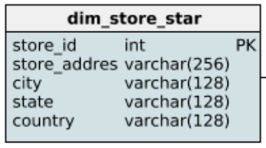

Here are the normalized dimension tables representing the book stores.  
Do you notice that the way we structure these repeating groups is a bit different from the book dimension? 
An author can have published in different genres and with various publishers, hence why they were different dimensions.  
However, a city stays in the same state and country; thus, they extend each other over three dimensions.

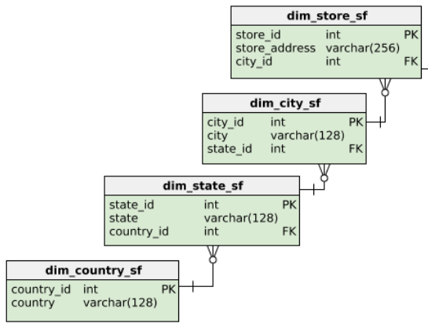

#### WHY would we want to normalize the database?
The normalized snowflake schema has considerably more tables. This means more joins, more CPU usage, slower indexing and reading which means slower queries. 
So why would we want to normalize a database?

1. **Normalization saves space.** This isn't intuitive seeing how normalized databases have more tables.  
Here we see a lot of repeated information in bold - such as USA, California, New York, and Brooklyn. This type of denormalized structure enables a lot of data redundancy. 
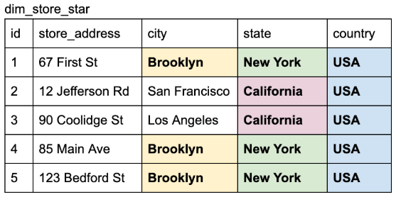 
If we normalize that previous schema, we get this: We see that although we are using more tables, **there is no data redundancy**. The string, Brooklyn, is only stored once. And the state records are stored separately because many cities share the same state, and country. 
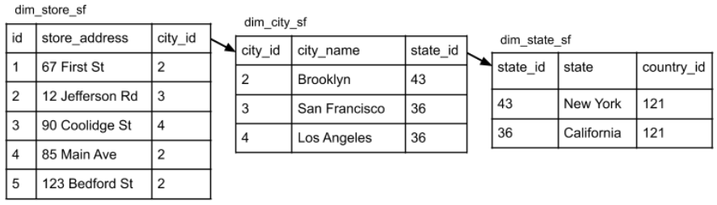

2. **Normalization ensures better data integrity** through its design.  
First, it enforces data consistency. 
Data entry can get messy, and at times people will fill out fields differently. Since the states are already entered in a table, we can ensure naming conventions through referential integrity. 
Secondly, because duplicates are reduced, modification of any data becomes safer and simpler. 
Lastly, since tables are smaller and organized more by object, its easier to alter the database schema.
 
 

#### Normal Forms
There are different extents to which you can normalize. These are called normal forms. Below is a list of them from least to most normalized. Each has its own set of rules, and some build on top of each other. We'll only cover the first three normal forms.

 
 

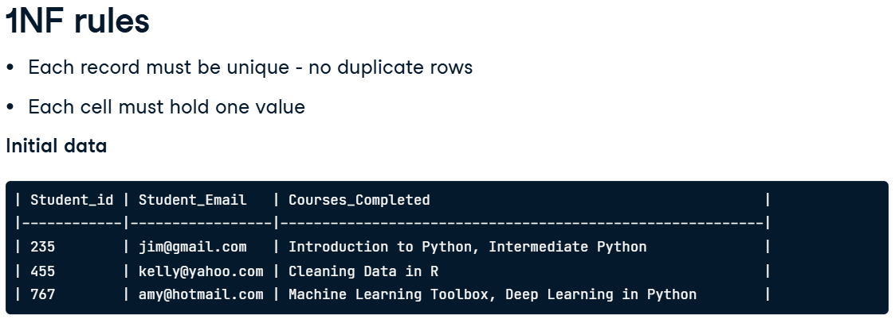
All these rows are unique, but the courses_completed column has more than one course in two records.
To rectify this, we can split the original table as such. Now, all the records are unique and each column has one value.

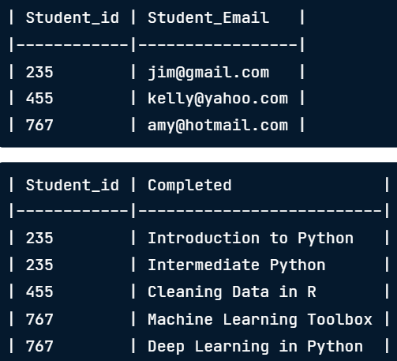
 
 

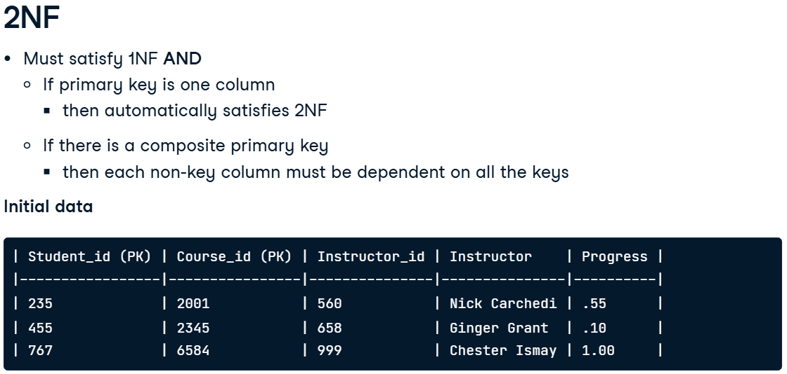
In this table, we have the student and course id as a composite primary key. We then review the other columns and their dependence on these two keys. First is the instructor, which isn't dependent on the student_id - only the course_id. Meaning an instructor solely depends on the course, not the students who take the course. The same goes for the instructor_id column. However, the percent completed is dependent on both the student and the course id. 
To convert it, we can create two new tables that satisfy the conditions of 2NF.

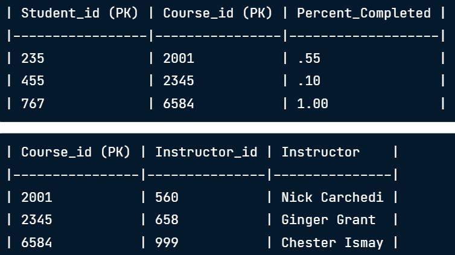
 
 

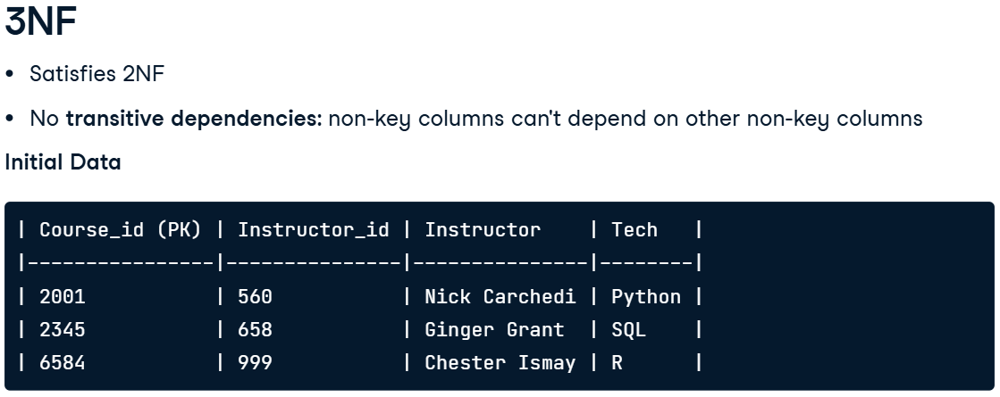
3NF doesn't allow transitive dependencies. This means that non-primary key columns can't depend on other non-primary key columns. Let's take a look at an example. Course_id is the primary key so we can ignore this column. Instructor_id and Instructor definitely depend on each other. Tech does not depend on the instructor as an instructor can teach different technologies. 
We can replace the table from before into these two tables to meet 3NF criteria. These tables have no transitive dependencies and they also meet 2NF as there are no composite primary keys.

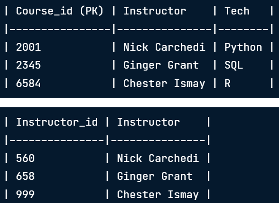
 
 

#### Data anomalies
It's time to consider why we would want to put effort into normalizing a database even more? Why isn't 1NF enough? A database that isn't normalized enough is prone to three types of anomaly errors: update, insertion, and deletion.

1. An **update anomaly** is a data inconsistency that can arise when updating a database with redundancy.  
If we want to update the email of student 520, we would have to update multiple records. 
It may sound easy to update multiple records, but it's risky because it depends on the db-user updating- if they remember this redundancy. And this is a simple example - as we scale, it's harder to keep track of these redundancies. 
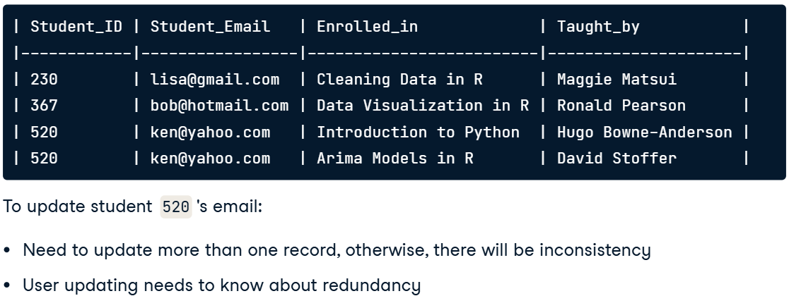

2. An **insertion anomaly** is when you are unable to add a new record due to missing attributes. 
For example, if a student signs up for DataCamp, but doesn't start any courses, they cannot be put into this database. The only exception is if the enrolled_in column can accept nulls.  
The dependency between columns in the same table unintentionally restricts what can be inserted into the table.  
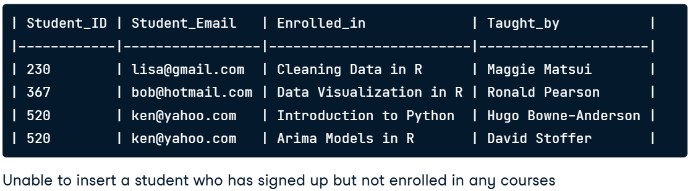

3. A **deletion anomaly** happens when you delete a record and unintentionally delete other data.  
For example, if you were to delete any of these students, you would lose the course information provided in the columns enrolled_in and taught_by.  
This could be resolved if we put that information in another table.
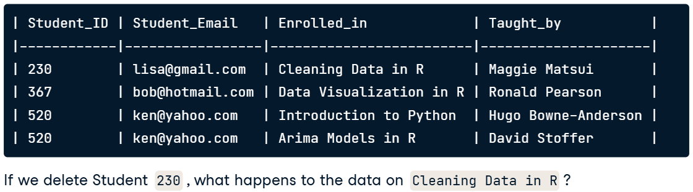

**The more normalized the database, the less prone it will be to these anomalies.**  
**For example, most 3NF tables can't have an update, insertion, and deletion anomalies. This makes normalization sound great! BUT remember the downsides, longer/more complex/slower queries, more complex structure and more CPU and ram needed to run those queries!**

## Database Views
Essentially, **views are virtual** tables that are not part of the physical schema. A view isn't stored in physical memory; instead, the query to create the view is.  
The data in a view comes from data in tables of the same database. Once a view is created, you can query it like a regular table.  
The benefit of a view is that you don't need to retype common queries. It allows you to add virtual tables without altering the database's schema.  

Here's an example. Let's say analysts at your company are often running analytics on the science fiction genre. To help their workflow, you want to create a view specifically dedicated to the science fiction genre and its associated book titles and authors.  

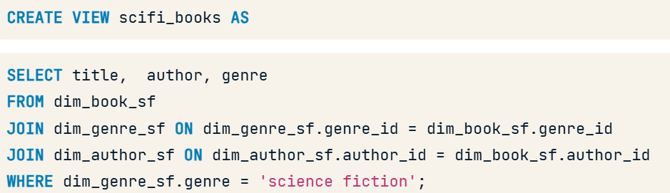

After executing the code from the last slide, you can query the view.
Scifi_books isn't a real table with physical memory. When we run this select statement, the following query is actually being run.

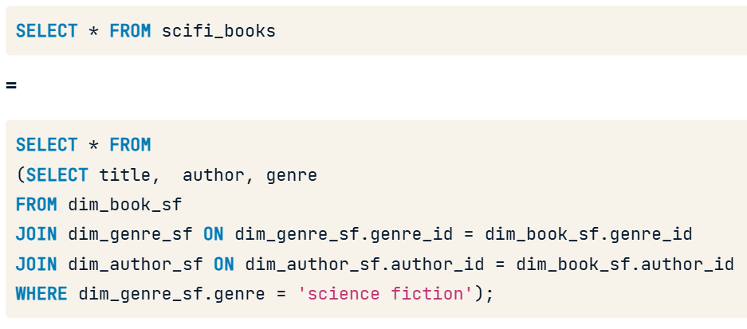

To get all the views in your database, you can run a query on the INFORMATION_SCHEMA.views table.  
To exclude system views and to get to views you've created, use this query. It excludes views from pg_catalog and information_schema which are built-in view categories.  

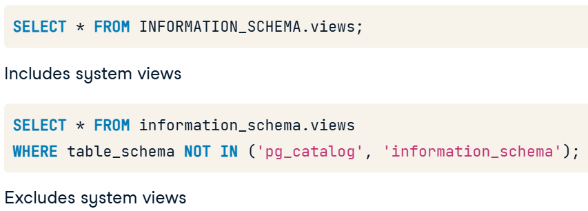

### Benefits of views:
- A view **doesn't take up any storage** except for the query statement, which is minimal.
- Views act as a form of **access control**. For example, instead of giving a user access to columns that may have sensitive information, you can restrict what they can see via a view.
- Views **mask the complexity** of queries.
- Views are **handy for views normalized past the 2NF**. You can make those common joins -such as aggregating dates or genres- into views.

### Managing views
To give and remove user permissions, we use the SQL GRANT and REVOKE command. The syntax is as follows:
1. First, you list the relevant privileges after the GRANT and the REVOKE command. There are several types of privileges users can execute (SELECT, INSERT, UPDATE, DELETE, etc).
2. Then you indicate on which object (table, view, schema, etc.) and for which role (db user or gorup of users). You use the TO clause and FROM clause, respectively, for grant and revoke. 

Here's an example. The update privilege on an object called ratings is being granted to public.  
**PUBLIC** is a SQL term that encompasses **all users**. All users can now use the UPDATE command on the ratings object.  

In the second line, the user db_user will no longer be able to INSERT on the object films. 

 
 

### Updating a view
A user can UPDATE a view if they have the necessary privilege.  
If you remember correctly, a view isn't a physical table. Therefore, when you run an update, **you are updating the tables behind the view** (don't fucking do it Jimmy).  
Only particular views are updatable. The criteria depend on the type of SQL being used. Generally:
- The view needs to be made up of one table.
- Can't rely on a window or aggregate function.
  
 

### Inserting into a view
The INSERT command is in a similar case as the UPDATE command. When you run an insert command into a view, you're **again** really inserting into the table behind it.  
The criteria for inserting is usually very similar to updatable views.

`Generally, avoid modifying data through views. It's usually a good idea to use views for read-only purposes only.`

### Droping a view
Dropping a view is straightforward with the DROP command. There are two useful parameters to know about: CASCADE and RESTRICT:
- The RESTRICT parameter is the default and returns an error when you try to drop a view that other objects depend on.  
- The CASCADE parameter will drop the view and any object that depends on that view.

### Redefining a view
Say you want to change the query a view is defined by. To do this, you can use the CREATE OR REPLACE command:
- If a view_name exists, it is replaced by the new_query specified.
- The new query must generate the same column names, column order, and column data types as the existing query.
- The column output may be different, as long as those conditions are met.
- New columns may be added at the end.  

  
`If this criteria can't be met, the solution is to drop the existing view and create a new one.`

### Altering a view
The ALTER VIEW statement allows you to change various properties of a view.  
The statement will issue an error if you don't use the IF EXISTS and attempt to change a non-existing view. But when you use the IF EXISTS, the statement issues a notice instead. **The IF EXISTS is optional.**

The auxiliary properties of a view can be altered. I list the various options here. This includes changing the name, owner, and schema of a view.

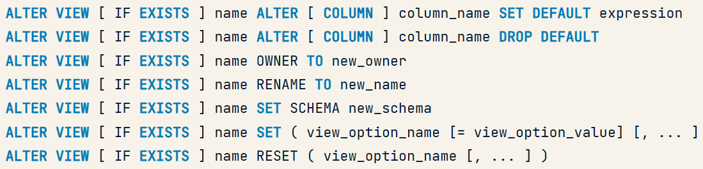

### Materialized views
There are two types of views. When you come across the term "view" plainly, it is most likely referring to non-materialized views. 
As the names begin to hint, materialized views are physically materialized, while non-materialized remain virtual. 
- Materialized views **stores the query results**. These query results are **stored on disk**.
- The query becomes precomputed via the view. When you query a materialized view, it accesses the stored query results on the disk, rather than running the query like a non-materialized view and creating a virtual table.
- Are refreshed or rematerialized when prompted or scheduled.
- Materialized views are great if you have queries with long execution time.
- Allow data scientists and analysts to run long queries and get results very quickly. 
- Materialized views are particularly useful in data warehouses where data is not so write intensive. 

`The caveat is the data is only as up-to-date as the last time the view was refreshed. So, you shouldn't use materialized views on data that is being updated often, because then analyses will be run too often on out-of-date data.`

Creating materialized views is very similar to creating non-materialized views, except that you specify "Materialized" in the SQL statement.  

You use the "REFRESH MATERIALIZED VIEW" syntax to refresh a view. 
There isn't a PostgresSQl command to schedule refreshing views. However, there are several ways to do so, like using cron jobs. 

### Materialized views dependencies
Unlike non-materialized views, you need to manage when you refresh materialized views when you have dependencies.

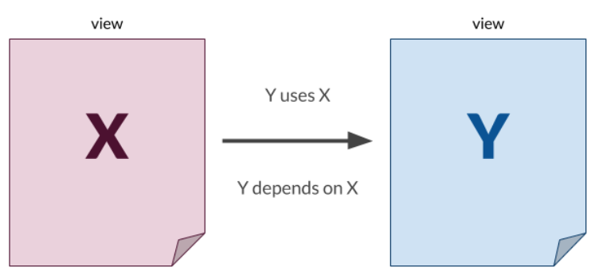

For example, let's say you have two materialized views: X and Y. Y uses X in its query; meaning Y depends on X. X doesn't depend on Y as it doesn't use Y in its query. Let' s say X has a more time-consuming query. If Y is refreshed before X's refresh is completed, then Y now has out-of-date data.

This creates a dependency chain when refreshing views.  **Scheduling when to refresh is not trivial**.  
Refreshing them all at the same time is not the most efficient when you consider query time and dependencies.

Companies that have many materialized views, use directed acyclic graphs (**DAG** finite directed graph with no cycles) to track dependencies and pipeline scheduler tools, like Airflow and Luigi, to schedule and run REFRESH statements.

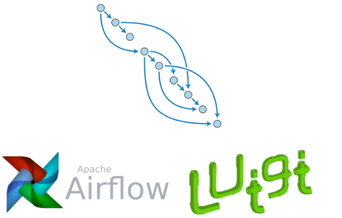
`Here, you can see an example where the directed arrows reflect a dependency in a certain direction where one node depends on another. The no cycles part is important because two views can't depend on each other - only one can rely on another.`

## Database Roles and Access Control
