# Data Warehousing Concepts
A data warehouse is a computer system designed to store and analyze large amounts of data for an organization. The warehouse becomes a central repository for clean and organized data for the organization. 

- Gathers data from different areas of an organization
- Integrates and stores the data
- Make it available for analysis
 
 

**Organizations implement data warehouses in order to:**
- Support business intelligence activity.
- Enable effective organizational analysis and decision-making.
- Find ways to innovate based on insights of from their data.
 
 

**Common scenarios:**
- Product sales forecasting.
- Create reports for governance and regulation adherence.
- Insight and growth.

## Data Warehouses vs. Data Lakes
Data warehouses gather data from different areas of an organization, integrate it, and make it available for analysis. They are built as a central data store for the entire organization, representing many departments. Therefore, there are many data sources as input to the data warehouse, including multiple databases or even non-databases such as a log file. 

All this data is collected, transformed if needed, and integrated into a **structured format** into the data warehouse in an ETL process. 
It is important to note that data in the data warehouse is structured into tables with rows and columns. This structure can make it complex to change because of upstream and downstream effects. 
Also, data warehouses are large, typically larger than 100 GB. 

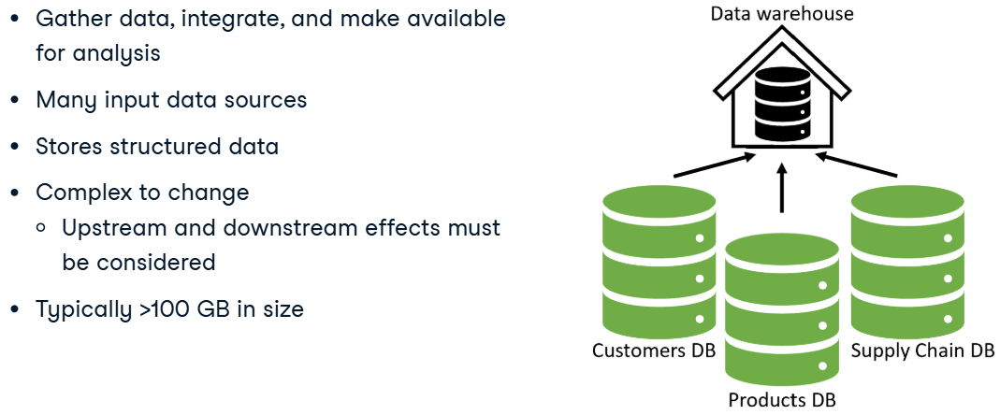

#### Upstream effects
These involve changes that occur before data reaches the data warehouse. Any modification to upstream systems can impact how data is collected, processed, and stored. Examples include:

- Source system changes: If a transactional database schema is altered (e.g., a column is removed), it can break ETL processes that depend on it.
- ETL pipeline failures: If an upstream data ingestion job fails, the warehouse might not receive fresh data, causing reports to be outdated.
- Data quality issues: Incorrect or missing data from sources can propagate through the pipeline, leading to inaccurate analytics.

#### Downstream effects
These involve changes in the data warehouse that affect systems relying on it. Examples include:
- Schema changes: Renaming a column or modifying data types in the warehouse can break reports and dashboards.
- Data refresh delays: If an ETL job is delayed, business intelligence tools might work with stale data.
- Transformation logic changes: Updating how data is processed can alter analytics results, affecting business decisions.

`In summary, upstream effects impact how data enters the warehouse, while downstream effects affect how data is used after being stored.`

### Why the data warehouse?
You might think, why not query the different transactional databases when performing an analysis versus using a data warehouse? 

Running queries involving a large amount of data could take a very long time, possibly **slowing down** the database and restricting it from its primary purpose of recording transactions. Also data might be dispersed in multiple db or in different formats such as CSVs!
 
 

### Data marts
A data mart is a relational database that stores an organization's transactional data for analysis. 

Data marts and data warehouses both hold structured data. However, whereas a data warehouse contains data from many different departments, a data mart only focuses on one department, such as just Finance. 

Data marts have only a few input data sources versus a data warehouse with many. Often the input source is a subset of data from a data warehouse. 
Additionally, a data mart is typically less than 100 GB, which is smaller than most data warehouses. 

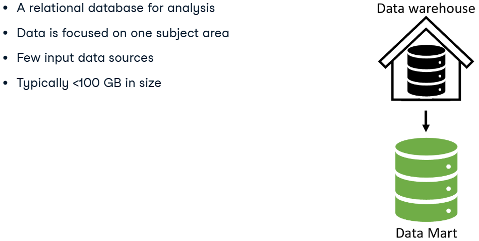
 
 

### Data lakes
Data lakes, similar to data warehouses, are built as a central store of data for the entire organization for analysis. Therefore, they store data for many different departments, have many input data sources, and are large. However, data lakes can hold non-structured data, such as videos or audio files. A Data Scientist might use this unstructured data in a model that analyzes video of a production process for quality control. 

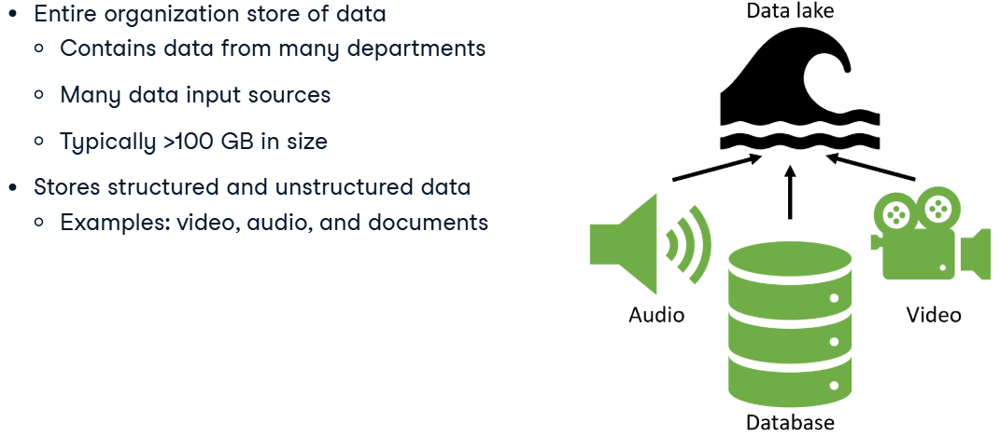

Compared to data warehouses, it is easier to make changes to data lakes because of their flexibility in storing unstructured data. This flexibility also allows storing data whose purpose may not be known today but may be helpful for future analysis. In contrast, when designing table structures for data warehouses and marts, organizations tend to know how they want to use the data for analysis. 

### Summary

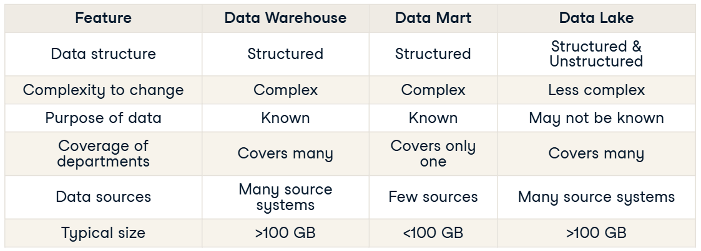

## The Warehouse Lifecycle
At a high level, the first step is the planning phase, where the team begins to plan how to design the data warehouse to satisfy the organization's needs. 
Next is the implementation phase, where the team builds the data warehouse. 
Finally, in the support and maintenance phase, the team trains end users and maintain the warehouse. 

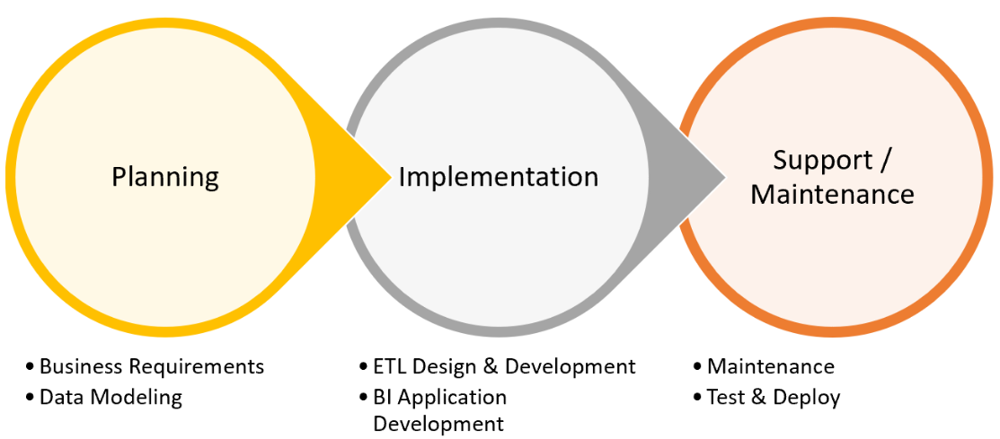

### Planning
In the planning phase, there are different sub-stages.
1. **Requirements gathering** is first. The goal here is to understand the organization's needs. Who and how will they use the data warehouse? 
`Typical task supporters: Analyst & data scientist.`
2. **Data modeling** is next. It is planning based on business requirements on how the team transforms data from different input sources and integrates it into our data warehouse. Crucial is that the team understands and links the relevant data sets. 
`Task supporters: Analyst, data engineer & database admins.`

### Implementation
1. **ETL design & development**. This step is about designing and building the data pipelines that extract, transform, and load data from the different sources into the data warehouse. 
`Task supporters: Data engineer & database admins.`
2. **BI application development**. After the team loads the data into the warehouse, they work on BI application development. 
In this step, they set up BI or business intelligence tools to interact with the data warehouse and create reports needed by the organization. 
BI tools are often how many users interact with the data warehouse. Some standard BI tools include Tableau, Power BI, or Google's Looker. 
`Task supporters: Analyst & data scientist.` 

### Support / Maintenance
1. During the support and maintenance phase, the team can update the warehouse table designs or make other necessary changes. 
`Task supporter: Data engineer.` 

2. After this step, we get to testing and deployment.
    - Test the system to confirm the business requirements are met. 
    `Task supporters: Analyst, data scientist.`
    - Deploy and make the warehouse available to the organization. 
    `Task supporters: Data engineers.`

- After deployment, any significant changes will follow the same steps starting back at the planning phase.

## Layers of a Data Warehouse
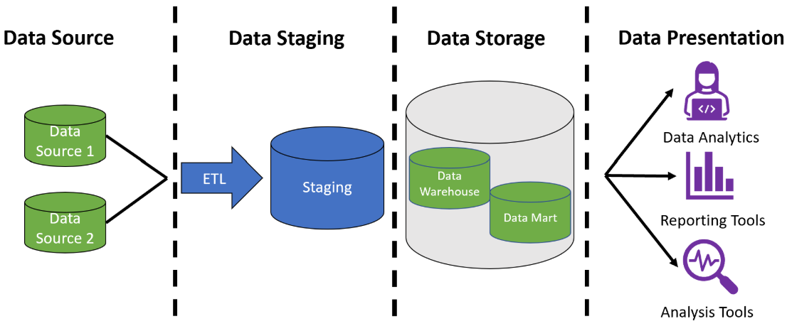

### 1 Data source layer
The data source layer includes all of the different sources for the data warehouse. Data sources can include different data types, such as files and databases.
 
 

### 2 Data staging layer
In the data staging layer, the source systems' data is extracted, transformed, and cleaned before being loaded into the next layer 
The staging layer includes the ETL process and a staging database that stores data temporarily during this step.
 
 

### 3 Data storage layer
In the data storage layer, data pipelines store the staging results in the data warehouse and data marts. 
Depending on the design, data from the ETL process will be stored directly in the data warehouse and then into the data marts. 
In other designs, the opposite happens where data moves to the data marts first and then to the data warehouse.
 
 

### 4 Data presentation layer
In the presentation layer, users interact with the stored data. 
Queries are run in this layer to facilitate analysis. This layer includes BI or Business Intelligence tools, data mining tools, and direct user queries, some of which have graphical user interfaces to visualize query results.
 
 

## Presentation Layer Groups
### Automated reporting/dashboarding
One of the great benefits of having a data warehouse is the ability to **automate reporting** and **create dashboards**. The data warehouse creates a central repository of data for the organization that can be queried. 

**Analysts** or **citizen data scientists** are often charged with setting up these reports. These tools tend to have graphical user interfaces with little coding required to use. This makes the data within the data warehouse available to users with a limited coding background. 

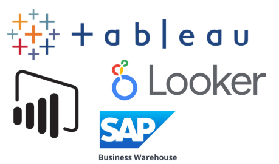
 
 

### BI/data analytics
BI and data mining tools are often used to **explore** the data and uncover **patterns**. **Analysts** or **data scientists** are likely to use these tools to convert data into actionable insights. 

These tools can vastly range in user interface complexity. Many still use graphical drag and drop, although they can also allow users to write code directly. The tools highlighted for reporting and dashboarding could also fit into this category. 

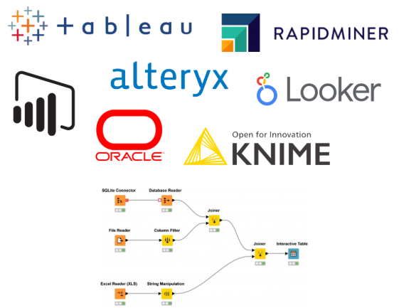
 
 

### Direct queries
SQL is often used to query from the data warehouse. Here users can **compose their own queries** of the data warehouse. A **data analyst**, **data scientist**, or **data engineer** with greater technical skills may want to use more advance tools. 
In addition, **R** and **Python** offer additional packages to do other sophisticated analyses of the data. 

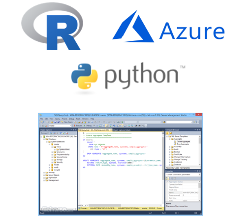
 
 

## Data Warehouse Architectures
### Inmon/top-down
Bill Inmon viewed the data warehouse as a tool to contain all of the organization's data. 
The **organization must decide** on the naming, the definition, which data is valid if there are conflicts, and all other data cleaning operations on all of the data before it enters the warehouse. 
This architecture stores data in the warehouse in a **normalized** form. 
The data **then moves** to a department-focused **data marts** where end users and applications can query it. 

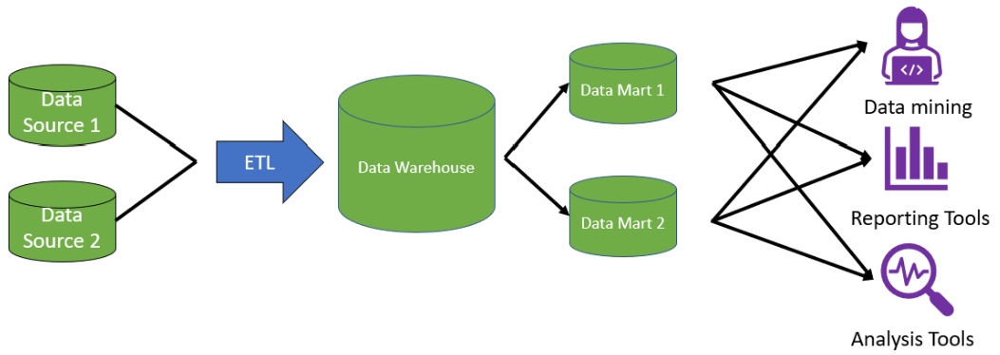

#### Advantages:
- Conforming the input sources into a single definition that the organization agrees upon makes the data warehouse an effective source of truth.
- Since the data is normalized within the warehouse, less storage is needed.
- Creating/changing data marts for reporting or analysis is relatively straightforward.
#### Disadvantages:
- Because the data is normalized, it requires more joins for reporting leading to slower response times.
- Gaining alignment by the organization on the data definitions can take a lot of upfront work resulting in a higher startup cost for warehouse projects.
 
 

### Kimball/botom-up
In this approach, once the data has been brought in, it is **denormalized into a star schema**. 
A star schema is a way of storing data that **makes query writing fast** and straightforward. 
In the Kimball approach, the focus is on getting from data to reporting **as fast as possible**. This is done by first organizing and defining the data definitions of one department of the organization, placing that data into a data mart, and making it available for reporting. 
After completing one department, a new department is chosen, and the cycle repeats. 

Various data attributes, such as name and location, connect the data marts. The data marts are then integrated into a data warehouse. 
It contrasts the top-down approach because the data moves to the **data marts first** and then to the warehouse. 

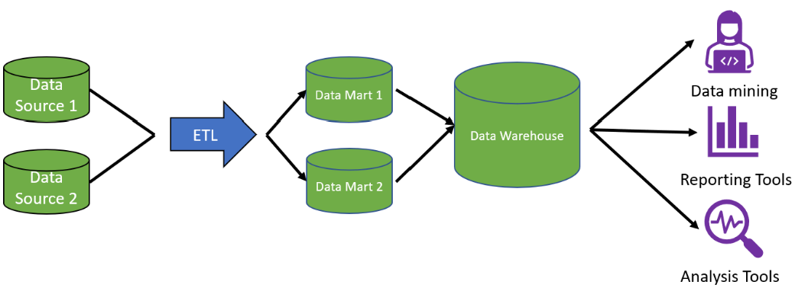

#### Advantages:
- Upfront development speed hence lower startup cost.
- The denormalized data model makes the data easy to consume for users.

#### Disadvantages:
- Denormalization increases the processing time within the ETL process.
- Denormalization increases the posibility of duplicate data.
- As the organization adds new departments or processes, more development will need to be done.

`The bottom-up approach has a lower upfront cost but requires more upkeep than the top-down approach.`

## OLAP and OLTP systems
### OLAP
OLAP stands for Online Analytical Processing. It is a tool for performing multidimensional analysis at high speeds on large volumes of data from a data warehouse, data mart, or some other centralized data store. 

OLAP systems take this two-dimensional representation of data in rows and columns and reorganize it into a multidimensional format that enables fast processing for analysis. 
This multidimensional format allows for what is commonly called "slicing and dicing" the data. 

#### OLAP cube
At the core of the OLAP system is the OLAP data cube, a multidimensional database that makes it possible to process and analyze multiple data dimensions faster than a traditional relational database. 
Data cubes that have more than three dimensions are called hypercubes. 

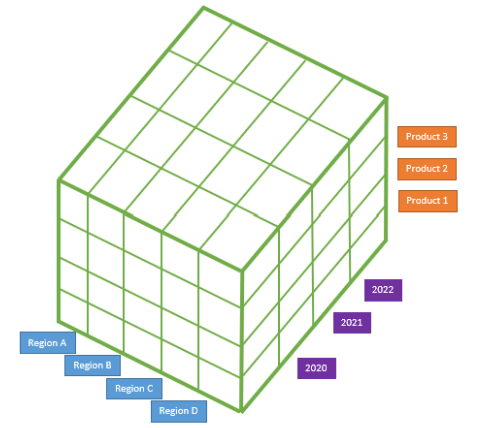

### OLTP
OLTP stands for online transaction processing. These systems are optimized for processing a large volume of simple database transactions and queries as quickly as possible. 
Typical uses of OLTP systems include cash terminals and reservation bookings. In these examples, the OLTP systems processes simple queries to the database, like inserting, updating, and deleting rows. 
Queries for OLTP systems tend to affect only a few rows of data within the database. 

OLTP systems are often critical for the business and not used for analysis. Organizations often use them in transactional databases or the source systems that feed into the data warehouse. 
 
 

### Summary
OLAP systems are designed to support data analysis. They execute complex queries of multiple rows or transactions faster than a traditional relational database. 
The core of the OLAP system is the data cube which represents the data in multidimensions allowing for data slicing. 

OLTP systems are designed to be very fast at performing simple database queries that focus on one or only a few rows of data. 
The core of these systems is the database table which stores the data in rows and columns. 

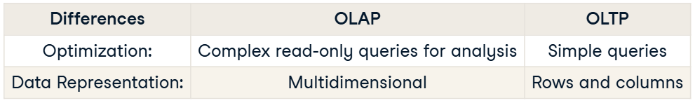

## Data Warehouse Data Modeling
