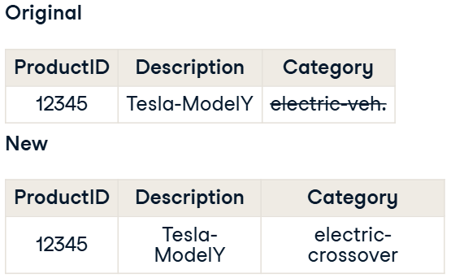
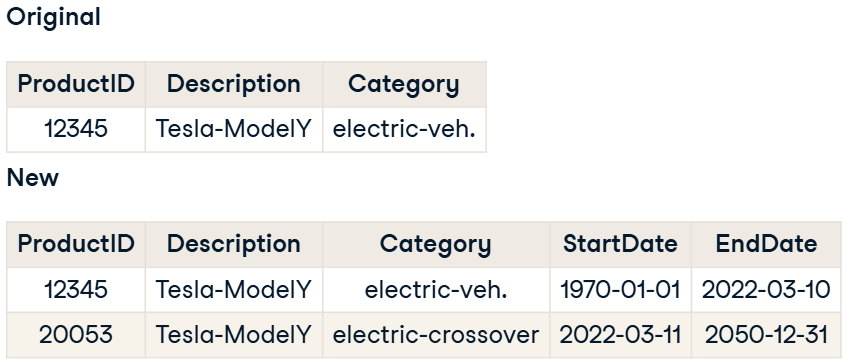
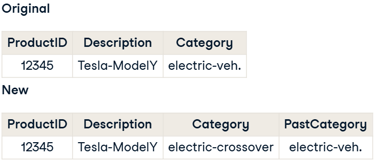
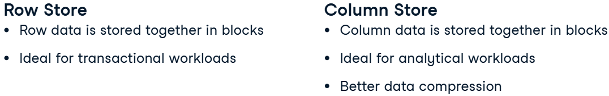
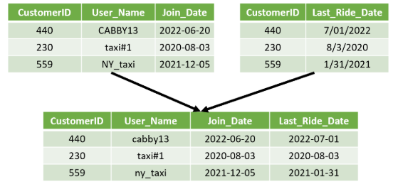
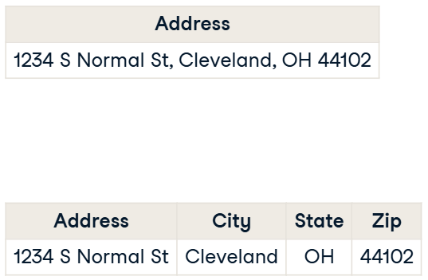
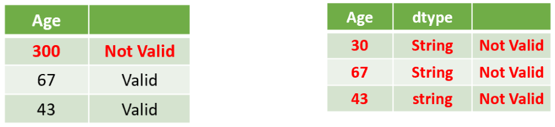
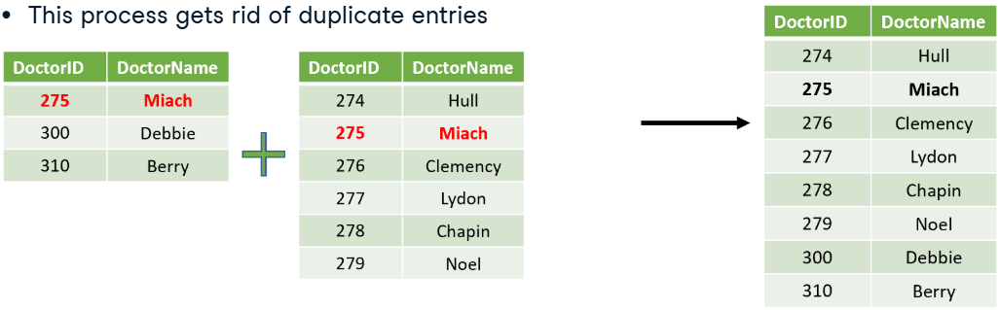
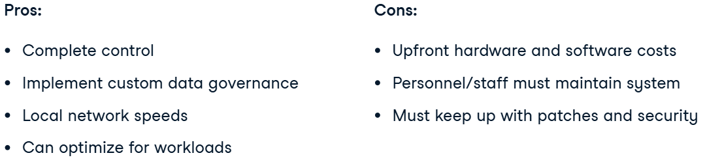
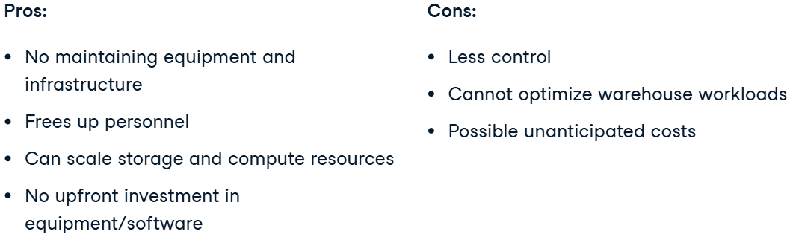

# Data Warehousing Concepts
A data warehouse is a computer system designed to store and analyze large amounts of data for an organization. The warehouse becomes a central repository for clean and organized data for the organization. 

- Gathers data from different areas of an organization
- Integrates and stores the data
- Make it available for analysis
 
 

**Organizations implement data warehouses in order to:**
- Support business intelligence activity.
- Enable effective organizational analysis and decision-making.
- Find ways to innovate based on insights of from their data.
 
 

**Common scenarios:**
- Product sales forecasting.
- Create reports for governance and regulation adherence.
- Insight and growth.

## Data Warehouses vs. Data Lakes
Data warehouses gather data from different areas of an organization, integrate it, and make it available for analysis. They are built as a central data store for the entire organization, representing many departments. Therefore, there are many data sources as input to the data warehouse, including multiple databases or even non-databases such as a log file. 

All this data is collected, transformed if needed, and integrated into a **structured format** into the data warehouse in an ETL process. 
It is important to note that data in the data warehouse is structured into tables with rows and columns. This structure can make it complex to change because of upstream and downstream effects. 
Also, data warehouses are large, typically larger than 100 GB. 

#### Upstream effects
These involve changes that occur before data reaches the data warehouse. Any modification to upstream systems can impact how data is collected, processed, and stored. Examples include:

- Source system changes: If a transactional database schema is altered (e.g., a column is removed), it can break ETL processes that depend on it.
- ETL pipeline failures: If an upstream data ingestion job fails, the warehouse might not receive fresh data, causing reports to be outdated.
- Data quality issues: Incorrect or missing data from sources can propagate through the pipeline, leading to inaccurate analytics.

#### Downstream effects
These involve changes in the data warehouse that affect systems relying on it. Examples include:
- Schema changes: Renaming a column or modifying data types in the warehouse can break reports and dashboards.
- Data refresh delays: If an ETL job is delayed, business intelligence tools might work with stale data.
- Transformation logic changes: Updating how data is processed can alter analytics results, affecting business decisions.

`In summary, upstream effects impact how data enters the warehouse, while downstream effects affect how data is used after being stored.`

### Why the data warehouse?
You might think, why not query the different transactional databases when performing an analysis versus using a data warehouse? 

Running queries involving a large amount of data could take a very long time, possibly **slowing down** the database and restricting it from its primary purpose of recording transactions. Also data might be dispersed in multiple db or in different formats such as CSVs!
 
 

### Data marts
A data mart is a relational database that stores an organization's transactional data for analysis. 

Data marts and data warehouses both hold structured data. However, whereas a data warehouse contains data from many different departments, a data mart only focuses on one department, such as just Finance. 

Data marts have only a few input data sources versus a data warehouse with many. Often the input source is a subset of data from a data warehouse. 
Additionally, a data mart is typically less than 100 GB, which is smaller than most data warehouses. 

 
 

### Data lakes
Data lakes, similar to data warehouses, are built as a central store of data for the entire organization for analysis. Therefore, they store data for many different departments, have many input data sources, and are large. However, data lakes can hold non-structured data, such as videos or audio files. A Data Scientist might use this unstructured data in a model that analyzes video of a production process for quality control. 

Compared to data warehouses, it is easier to make changes to data lakes because of their flexibility in storing unstructured data. This flexibility also allows storing data whose purpose may not be known today but may be helpful for future analysis. In contrast, when designing table structures for data warehouses and marts, organizations tend to know how they want to use the data for analysis. 

### Summary

## The Warehouse Lifecycle
At a high level, the first step is the planning phase, where the team begins to plan how to design the data warehouse to satisfy the organization's needs. 
Next is the implementation phase, where the team builds the data warehouse. 
Finally, in the support and maintenance phase, the team trains end users and maintain the warehouse. 

### Planning
In the planning phase, there are different sub-stages.
1. **Requirements gathering** is first. The goal here is to understand the organization's needs. Who and how will they use the data warehouse? 
`Typical task supporters: Analyst & data scientist.`
2. **Data modeling** is next. It is planning based on business requirements on how the team transforms data from different input sources and integrates it into our data warehouse. Crucial is that the team understands and links the relevant data sets. 
`Task supporters: Analyst, data engineer & database admins.`

### Implementation
1. **ETL design & development**. This step is about designing and building the data pipelines that extract, transform, and load data from the different sources into the data warehouse. 
`Task supporters: Data engineer & database admins.`
2. **BI application development**. After the team loads the data into the warehouse, they work on BI application development. 
In this step, they set up BI or business intelligence tools to interact with the data warehouse and create reports needed by the organization. 
BI tools are often how many users interact with the data warehouse. Some standard BI tools include Tableau, Power BI, or Google's Looker. 
`Task supporters: Analyst & data scientist.` 

### Support / Maintenance
1. During the support and maintenance phase, the team can update the warehouse table designs or make other necessary changes. 
`Task supporter: Data engineer.` 

2. After this step, we get to testing and deployment.
    - Test the system to confirm the business requirements are met. 
    `Task supporters: Analyst, data scientist.`
    - Deploy and make the warehouse available to the organization. 
    `Task supporters: Data engineers.`

- After deployment, any significant changes will follow the same steps starting back at the planning phase.

## Layers of a Data Warehouse

### 1 Data source layer
The data source layer includes all of the different sources for the data warehouse. Data sources can include different data types, such as files and databases.
 
 

### 2 Data staging layer
In the data staging layer, the source systems' data is extracted, transformed, and cleaned before being loaded into the next layer 
The staging layer includes the ETL process and a staging database that stores data temporarily during this step.
 
 

### 3 Data storage layer
In the data storage layer, data pipelines store the staging results in the data warehouse and data marts. 
Depending on the design, data from the ETL process will be stored directly in the data warehouse and then into the data marts. 
In other designs, the opposite happens where data moves to the data marts first and then to the data warehouse.
 
 

### 4 Data presentation layer
In the presentation layer, users interact with the stored data. 
Queries are run in this layer to facilitate analysis. This layer includes BI or Business Intelligence tools, data mining tools, and direct user queries, some of which have graphical user interfaces to visualize query results.
 
 

## Presentation Layer Groups
### Automated reporting/dashboarding
One of the great benefits of having a data warehouse is the ability to **automate reporting** and **create dashboards**. The data warehouse creates a central repository of data for the organization that can be queried. 

**Analysts** or **citizen data scientists** are often charged with setting up these reports. These tools tend to have graphical user interfaces with little coding required to use. This makes the data within the data warehouse available to users with a limited coding background. 

 
 

### BI/data analytics
BI and data mining tools are often used to **explore** the data and uncover **patterns**. **Analysts** or **data scientists** are likely to use these tools to convert data into actionable insights. 

These tools can vastly range in user interface complexity. Many still use graphical drag and drop, although they can also allow users to write code directly. The tools highlighted for reporting and dashboarding could also fit into this category. 

 
 

### Direct queries
SQL is often used to query from the data warehouse. Here users can **compose their own queries** of the data warehouse. A **data analyst**, **data scientist**, or **data engineer** with greater technical skills may want to use more advance tools. 
In addition, **R** and **Python** offer additional packages to do other sophisticated analyses of the data. 

 
 

## Data Warehouse Architectures
### Inmon/top-down
Bill Inmon viewed the data warehouse as a tool to contain all of the organization's data. 
The **organization must decide** on the naming, the definition, which data is valid if there are conflicts, and all other data cleaning operations on all of the data before it enters the warehouse. 
This architecture stores data in the warehouse in a **normalized** form. 
The data **then moves** to a department-focused **data marts** where end users and applications can query it. 

#### Advantages:
- Conforming the input sources into a single definition that the organization agrees upon makes the data warehouse an effective source of truth.
- Since the data is normalized within the warehouse, less storage is needed.
- Creating/changing data marts for reporting or analysis is relatively straightforward.
#### Disadvantages:
- Because the data is normalized, it requires more joins for reporting leading to slower response times.
- Gaining alignment by the organization on the data definitions can take a lot of upfront work resulting in a higher startup cost for warehouse projects.
 
 

### Kimball/botom-up
In this approach, once the data has been brought in, it is **denormalized into a star schema**. 
A star schema is a way of storing data that **makes query writing fast** and straightforward. 
In the Kimball approach, the focus is on getting from data to reporting **as fast as possible**. This is done by first organizing and defining the data definitions of one department of the organization, placing that data into a data mart, and making it available for reporting. 
After completing one department, a new department is chosen, and the cycle repeats. 

Various data attributes, such as name and location, connect the data marts. The data marts are then integrated into a data warehouse. 
It contrasts the top-down approach because the data moves to the **data marts first** and then to the warehouse. 

#### Advantages:
- Upfront development speed hence lower startup cost.
- The denormalized data model makes the data easy to consume for users.

#### Disadvantages:
- Denormalization increases the processing time within the ETL process.
- Denormalization increases the posibility of duplicate data.
- As the organization adds new departments or processes, more development will need to be done.

`The bottom-up approach has a lower upfront cost but requires more upkeep than the top-down approach.`

## OLAP and OLTP systems
### OLAP
OLAP stands for Online Analytical Processing. It is a tool for performing multidimensional analysis at high speeds on large volumes of data from a data warehouse, data mart, or some other centralized data store. 

OLAP systems take this two-dimensional representation of data in rows and columns and reorganize it into a multidimensional format that enables fast processing for analysis. 
This multidimensional format allows for what is commonly called "slicing and dicing" the data. 

#### OLAP cube
At the core of the OLAP system is the OLAP data cube, a multidimensional database that makes it possible to process and analyze multiple data dimensions faster than a traditional relational database. 
Data cubes that have more than three dimensions are called hypercubes. 

### OLTP
OLTP stands for online transaction processing. These systems are optimized for processing a large volume of simple database transactions and queries as quickly as possible. 
Typical uses of OLTP systems include cash terminals and reservation bookings. In these examples, the OLTP systems processes simple queries to the database, like inserting, updating, and deleting rows. 
Queries for OLTP systems tend to affect only a few rows of data within the database. 

OLTP systems are often critical for the business and not used for analysis. Organizations often use them in transactional databases or the source systems that feed into the data warehouse. 
 
 

### Summary
OLAP systems are designed to support data analysis. They execute complex queries of multiple rows or transactions faster than a traditional relational database. 
The core of the OLAP system is the data cube which represents the data in multidimensions allowing for data slicing. 

OLTP systems are designed to be very fast at performing simple database queries that focus on one or only a few rows of data. 
The core of these systems is the database table which stores the data in rows and columns. 

## Data Warehouse Data Modeling
Data modeling refers to how we organize data in a database into tables and how to relate those tables if we want to join them. 
When it comes to data modeling, the star and snowflake schemas are two common approaches for a warehouse using the bottom-up Kimball approach. 
These data models denormalize organizational data into dimensions and fact tables. 

Revisit this -> [DB design: dimensional model](../6-DB%20design/Database%20Design.md#dimensional-model)

## Kimball's Four Step Process
### Step 1
The first step is to **select an organizational process** for which we want to create a data model, such as invoice and billing, product quality monitoring, and marketing. 
In each of these processes, analysts and others will want to ask questions about the process and know how well they are performing. 
`Recall that the Kimball bottom-up approach first models one department or business process to create a data mart.`

### Step 2
In step two, we **decide on the grain**. The grain here means the level of data stored in the fact table. It's not required, but it advised that it is the lowest level possible. 
A level where you cannot split the data any further. If we were building a warehouse for a music service, we should choose the grain level to be individual songs versus a full album from a band. 
`Organizational users may be unable to answer the questions they have if we choose the wrong grain here, making the info and data warehouse less valuable or useless to them in extreme circumstances.` 

### Step 3
In this step three, we want to choose the dimensions that apply to each fact table row. Overall, we want to **add a rich set of dimensions** representing as many characteristics as possible of the fact table data. 
A data model may have a unique set of dimensions, but there are some that are typically used. For example, tracking the year, month, and the quarter is typical for any process that involves time. 
`Answering the question, "How do organizational users describe the data that results from the business process?" helps in this step. Also, it would be valuable for us to have feedback from analysts and other users who often work with the data.`

### Step 4
In step four, we want to **identify the numeric facts** that will populate each fact table row. Examples of possible facts for a fact table for a music service include the total number of plays or sales revenue for a song. 
These facts capture a measurement or metric of the process. Having members of the organization answer the question "What are we answering?" will help us identify numerical facts to include.  
Recall the purpose of the data warehouse is for reporting and analysis of the organizational process. We will need to decide on the vital numerical measures to store to answer likely questions about the process later.  
`Finally, the fact or metric chosen should be valid at the grain selected in step two.`

## Slowly changing dimensions
`This is Kimball's approach to modeling slowly changing dimensions. It should be noted that there is a modern approach to this challenge, but we will review first the historic standard approach.`

### The challenge
Over time, some values in our dimensional tables will need to be updated. 
For example, imagine we are working on a data warehouse for a used car dealership. We have a record in our product dimension table for Tesla's model Y. 
It was initially classified as an electric vehicle, but now we want to update values to something more descriptive, electric-crossover. 

There are three solutions for this problem: **type I**, **II**, and **III**. 
`This only applies to dimension tables. The value of the metrics captured in a fact table should stay the same over time.`

### Type I
The Type I methodology **updates the row's value** to the current value. This will update the value for any new reporting, but it also erases any history of the previous "electric vehicle" value.  
If we rerun any historical reports, this car will now show under the electric-crossover category. Therefore, these historical reports will not match the original values. 

`The reproducibility of reports is often an important requirement for organizations.`

### Type II
In Type II, we **add a new row** for Tesla to the dimension table with a new id and the updated category value. 
This will allow us to maintain any historical reports because those historical records in the fact table will reference product id 12345 in the dimensional table, and any new records in the fact table will reference 20053. 
Finally, we can add columns to track the start and end of when the values are in effect. 

### Type III
With type III, we **add another column** to the dimension table to capture the previous category. 
So, we set the value of the past category to electric vehicle and update the category to the new value of electric crossover. We will reference the past category column in the dimension table if we need to rerun a historical report. 
This approach supports looking at both a current and historical view simultaneously. 
However, this may require updating the coding for historical reports, and we are limited to tracking two historical changes in this setup. In theory, we can add more columns to track more changes. 

`Additionally, we can add a column to track the date on when we change the category.`

### Modern aproach
A modern approach takes advantage of the low storage costs by **saving snapshots** of the entire dimension table. 
We would update the value of the dimension table similarly to Type I, and the warehouse system stores snapshots of the current state of the dimension table. 
Therefore, when rerunning historical reports, we use the dimension table snapshot that was current at the time. 
`Typically, dimension tables have significantly fewer rows than fact tables, and storing duplicate copies of the tables is a manageable task for modern hardware.`

## Row vs. Column Data Store
Let's now turn our focus to column and row data storing. This subtle difference in how data is stored allows for the tuning of databases for transactional or analytical workloads. 

We want to optimize our queries for speed, and with data warehouses, we often work with analytical workloads. 
In summary, row data is stored together in blocks in the row store format. Also, it is ideal for transactional workloads. However, with column store, entire columns are held together in blocks. Thus, it best suits analytical workloads and has better data compression. 

## ETL and ELT
In an **ETL** process, the data is transformed and cleaned, then loaded into the data warehouse. 
**ELT** stands for extract, load, and transform. In this process, the data is extracted, loaded into the data warehouse, and then transformed. 
The overall goal for both methods is to end up with cleansed data that we can use in the data warehouse.

### ETL Pros and Cons
With the ETL process, the **data is transformed as it moves** from the inputs to the warehouse. 
This process requires organizations to use a cloud-based service or purchase the software and computer servers to run it themselves. 
Overall the ETL process requires a separate system from the data warehouse to perform the transformations as the data moves. 
`ETL process come about because the process only delivers cleaned and transformed data to the warehouse.`

**Pros:** 
1. Tends to have **lower data storage costs** than ELT because it only keeps copies of the transformed data.
2. **Meeting compliance** security standards on PII or personally identifiable information is more manageable.  
`We can omit PII data in the source systems before loading it into the warehouse, so sensitive data will never make it into our data warehouse, and many ETL tools are certified to meet government PII security standards.`

**CONS:**
1. We do **not store the original data** from the input sources during the transformation process. Any errors or changes to the transformation logic mean pulling the data from the source systems again.
2. There are costs related to the ETL's separate computer/cloud system while running.

### ELT Pros and Cons
The ELT process extracts data from the sources and **loads full copies** of that data into the data warehouse. 
Then the resources and software of the data warehouse are used to transform the data. Afterward, the transformed data is then used as usual for the data warehouse. 

**PROS:**
1. No need for a separate computer system for the transformation process.
2. We can **rerun the transformation** process without impacting the source systems.
3. It is often used for **near real-time** situations because the amount of time needed to load the data is not connected to the complexity of the transformations in the ELT process.

**CONS:**
1. The need for **more storage** to hold the copies of the original data.
2. Additional considerations are needed to comply with the security standards if the data **sources contain PII data**.

## Data Cleaning
This is a partial list. When implementing the data transformation process, the implementation team will evaluate the organizational requirements and use a combination of these four processes and others to meet the needs. 

### Data format cleaning
The data warehouse receives data in all types of formats. Therefore, it is essential to use organizational rules to format the data so that the output is consistent.  

`Unfortunately, within the first table, the capitalization of the user's names is inconsistent. Also, the date format in the other table is not what we want. So we cleanse the data by adjusting both formats in the final joined table.`

### Adress parsing
Parsing addresses is another typical cleansing operation. This process takes an address and divides it into individual components, like city and state. This helps standardize the data. 
Additionally, many ETL tools can automatically perform address lookups and validate the address. 

### Data validation
Two common validation checks include range and type checks. 
First, range checks to see if the data values are in the proper range. For example, you would not expect to see a person's age entered as 300 years old. 
Another validation check looks at the data type of the value. For example, imagine the data from our source system returned a data type of string for customers' ages. 

`It is best to fix these issues in the input source if possible, but if not, maybe there is an organizational rule that can be used to set a default value or exclude rows that fail validation checks.`

### Duplicate row elimination
The deduplication step removes repeated rows of data. In this example of hospital doctor data, we have two tables. 
We do not want duplicate rows. Deduplication will flag that doctor id 275 is a duplicate and will only append rows 300 and 310. 

`Data governance looks to develop rules and definitions around the data and detect and correct the data that deviates from its definition. Therefore, by the time it gets to the ETL or ELT process, less data cleaning needs to be done.`

## On Premise and Cloud Data Warehouses
### On premise
When implementing a data warehouse on-premise, organizations purchase the servers and computer hardware and install all the necessary software at some physical location within the organization.

### In the cloud
Over the last few years, there has been a rapid rise in the use of cloud services. Some cloud data warehouse providers include Amazon's Redshift, Microsoft's Azure Synapse, Snowflake, and Google's Big Query.

### Hybrid approach
Organizations may implement a warehouse using a hybrid approach where they will operate a data warehouse on the premise and in the cloud. One reason for doing this is for backup or disaster recovery.
