# Introduction to Snowflake
## What is Snowflake?
Snowflake is a cloud-based data warehouse that utilizes a columnar data storage model. 

Being purpose-built for the cloud, Snowflake boasts high scalability and flexibility. By organizing data in columns, queries in Snowflake run significantly faster, enabling improved performance and efficiency. It has a unique ability to connect with multiple cloud providers like AWS, GCP, or Azure. 

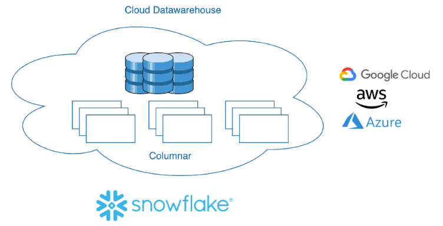

- With Snowflake, we can efficiently store, transform, and manage large datasets.
- Snowflake excels at integrating and analyzing diverse data sources seamlessly.
- Snowflake's data-sharing capabilities allow for easy collaboration and data exchange among different teams and organizations.

## Snowflake Architecture
Traditionally, many databases follow a "Shared-Disk" architecture. In this, each node, think of a processor or computer, has its own memory and CPU but shares the same storage, allowing any node to read or write to any part of the shared storage. 

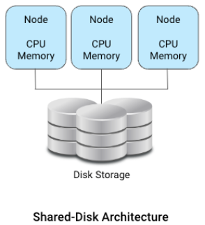

On the other hand, "shared-nothing" architecture separates storage and compute. Here, every node has its own disk storage. 
This is a key concept called "decoupling storage and compute". This ensures data is stored efficiently and processed independently, allowing each component to operate without relying on the other. 

Snowflake adopts this decoupling. The real benefit? Enhanced scalability. Snowflake can store more data or process data faster independently, leading to quicker responses and more cost-effective operations. 

It’s important to note that Snowflake uses a hybrid architecture. 
While it has a shared storage layer centralizing all data, its computing is distinctively decoupled. 

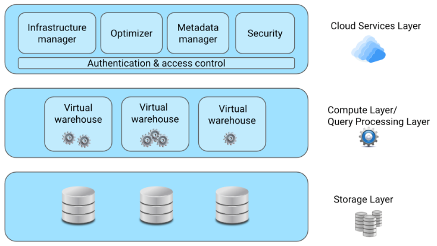

### Storage layer

- When data is loaded into Snowflake, it organizes it in a columnar storage format.
- Snowflake takes care of all internal optimizations and compression.
-Snowflake's storage layer consists of tables, schemas, and databases, providing structured organization for our data.

### Compute layer

- Snowflake uses something called "virtual warehouses" to accomplish this. Virtual warehouses are temporary computing resources created when a user submits a query.
`This means it works on different parts of the query and performs operations like scanning data, filtering, aggregation, and joining based on the query requirements. It's like having a group of experts ready to work together and process our queries smoothly and effectively.`
- Virtual warehouses can be scaled up or down as needed.
- Snowflake offers virtual warehouses in different sizes, and we pay for the size we select.

### Cloud services layer

- This layer ensures when we run a query, the right resources, compute, and storage are allocated efficiently to get quicker results.
- It's also in charge of maintaining the security of our data and controlling data access.

## Snowflake Competitors
Here are some of the key competitors to Snowflake. We will, in detail, compare Snowflake to Google BigQuery, Amazon Redshift, and Databricks, the three big cloud provider's data platforms. 
Additionally, PostgreSQL, an on-premise database, is included to better understand its differences from Snowflake. 

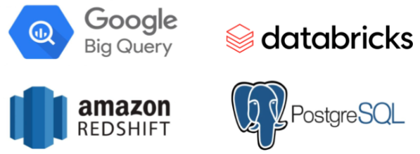

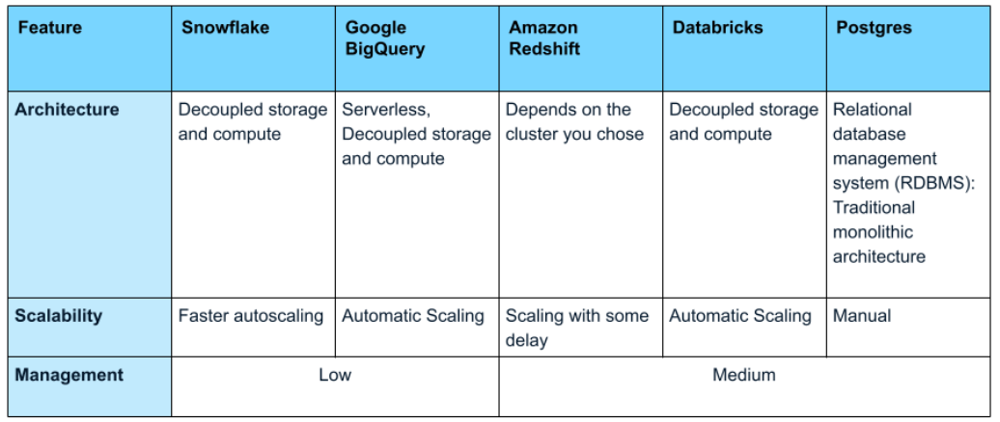

- All platforms provide access controls, managing who can query or access datasets and ensuring data **security and privacy**.
- They also offer **encryption**. That ensures data remains protected. 
`However, each platform has different means to achieve the same.`
- They all have semi-structured data support. 
`However, how they store it varies for each platform.`
- Databricks also support unstructured data like text, images, and audio.

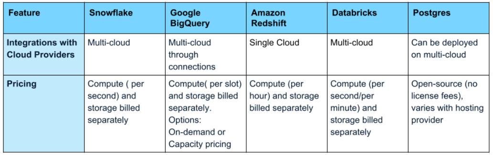

### What makes snowflake unique?
What makes Snowflake unique is its decoupled compute and storage architecture, making it ideal for workloads that require a lot of data processing or need to scale up or down quickly. 
- Snowflake allows secure data sharing between organizations, departments or users, ensuring the data's confidentiality, integrity, and privacy.
- It is designed to handle complex queries efficiently, making it highly performant.
- Snowflake's additional unique aspect is its multi-cloud support. And it's simple pay-as-you-go pricing.
- Additionally, it offers a user-friendly interface with a low learning curve, making it easy to use. This also makes it a good option for organizations new to data warehouses.

## Connecting to Snowflake and DDL commands
### Web interface
One of the most user-friendly options is the Snowflake Web Interface, often called **Snowsight**. 
It is the simplest way to get started. Simply sign up, create an account, and navigate through databases, schemas, tables and views displayed on the left panel. 

For those looking to draft and run queries, Snowflake provides **'Worksheets'**. It is an interface for creating and submitting SQL queries. 

### Drivers & connectors
Snowflake also supports connections via **ODBC** (Open Database Connectivity) and **JDBC** (Java Database Connectivity) drivers. 
These drivers enable tools, like DB Visualizer and Tableau to access Snowflake's databases, making Snowflake's data accessible across various applications. 

Additionally, there are **purpose-built connectors for languages**, such as Python, to enhance Snowflake integration. 

**SnowSQL** is another way to directly connect to your Snowflake account using the command line. Before using SnowSQL, we need to install it.

### Staging
Think of it as a 'waiting area' where data files are **temporarily stored** before they are loaded into the main tables. If data is stored inside Snowflake, it's called internal, if it's in outside platforms like Amazon S3 or Google Cloud Storage, it's called external stage. Raw data, like a CSV file, first enters this staging area. Afterwards, it's loaded into database tables. 

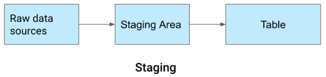

For instance, to add 'orders.csv' to Snowflake, we set up a local stage using CREATE STAGE. 
Next, we shift the file into our designated staging area and use the PUT command. Here, the '@' symbol references our stage name. Once our data is in the stage, we have options: validate, transform, or directly push it to a table. 

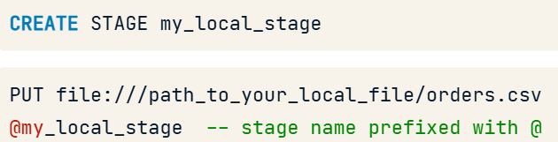

### DDL (data definition language) commands
DDL is used to define and manage the structure of a database, like creating tables or defining relationships. 
We might remember commands like CREATE, ALTER, DROP, and RENAME. Let’s see their syntax in Snowflake which resembles PostgreSQL. 

#### Create
To create a table named 'orders_pizza', we write 'CREATE TABLE' similar to Postgres. 

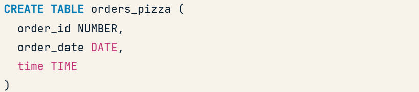 
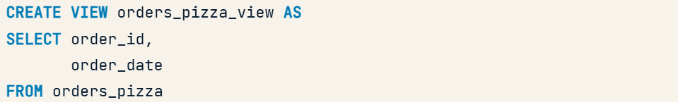

#### Alter, rename, drop
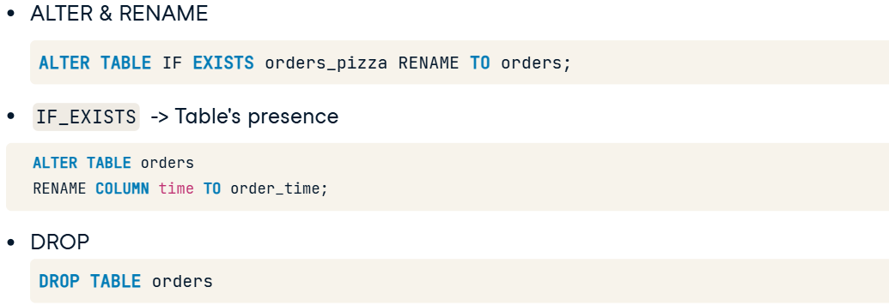

#### Comment
It acts as metadata for columns or tables. 
To annotate the 'pizza_type_id' column in the 'pizza_type' table, append 'COMMENT' after the column type. 
For table-level comments, place 'COMMENT' at the end of the 'CREATE TABLE' statement. 

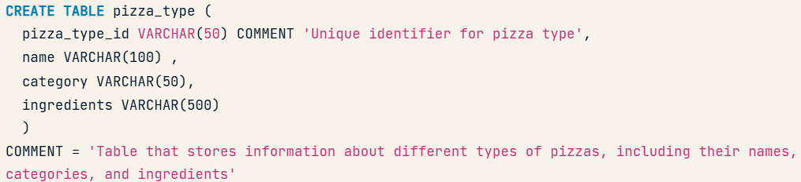

## Database Structures and DML
### Show
Snowflake offers the keyword 'SHOW' and we can use 'SHOW DATABASES' to view available databases. 
This command lists database names, owners, comments, and more. 

Likewise, 'SHOW TABLES' lets us inspect tables in Snowflake. Sgoes for Schemas, columns and views 
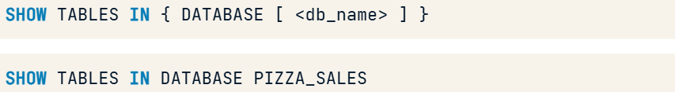 
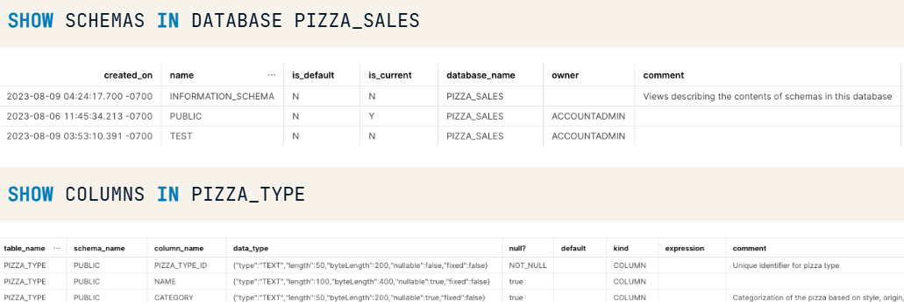 
 

It also offers to inspect tables using the optional argument 'LIKE'. 
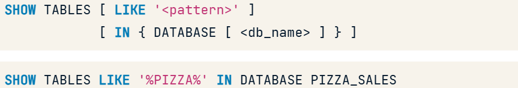

### Describe
It can also be abbreviated as DESC. DESCRIBE DATABASE PIZZA_SALES gives an in-depth description of the PIZZA_SALES database.
Similarly, to understand the PUBLIC schema, we use DESCRIBE SCHEMA command. 
Same goes for tables, views and stages. 
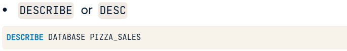

### Merge
Merge combines data from two tables, helpful in synchronizing similar tables. 

Here, we're updating records in 'orders_filtered' based on matching records in 'orders'. 'orders_filtered' is the table we want to update (or insert it into, if necessary). It's referred to as "target" table. The reference or "source" table is 'orders'. ON condition determines how the two tables are related. Here, they are linked by the 'order_id'. When there's a match, 'orders_filtered' updates its 'order_date' and 'time' from 'orders'. 

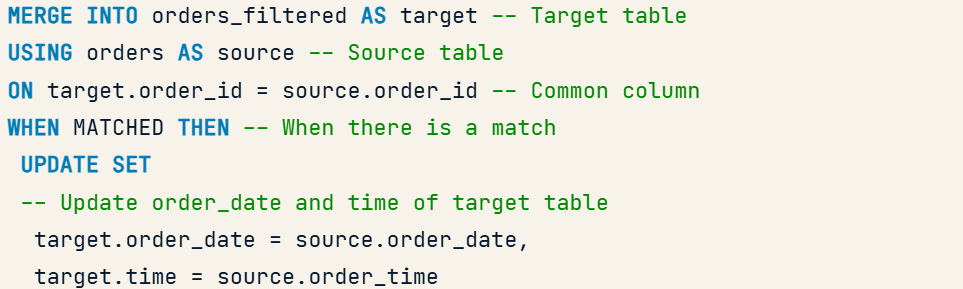 
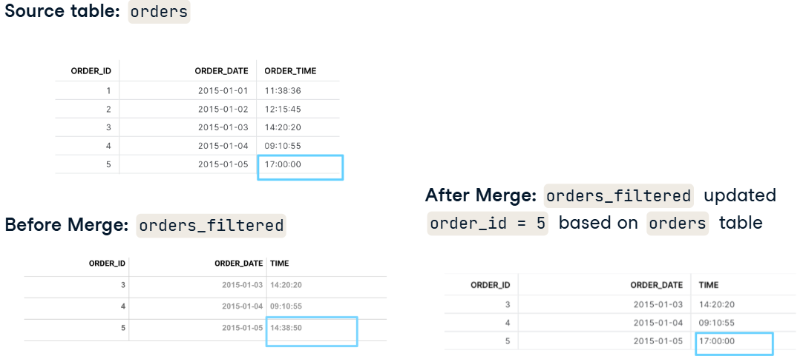

### Copy
Snowflake uses the 'COPY INTO' command. This command is used to load data from a specified file or stage into a Snowflake table. 
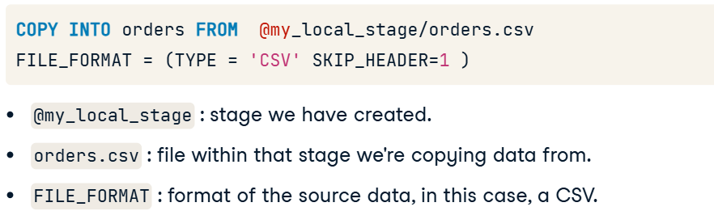

## Data Type and Conversion
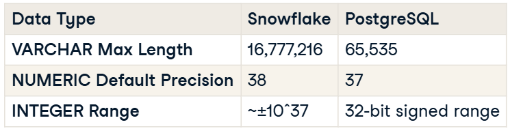

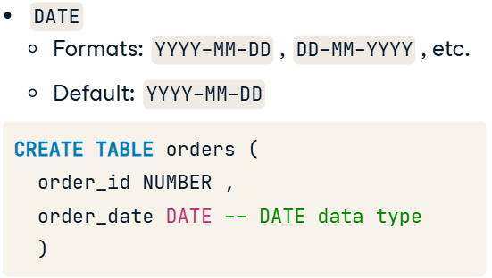

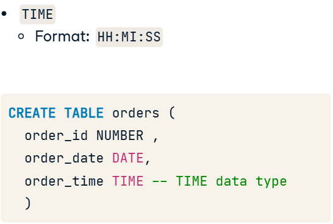

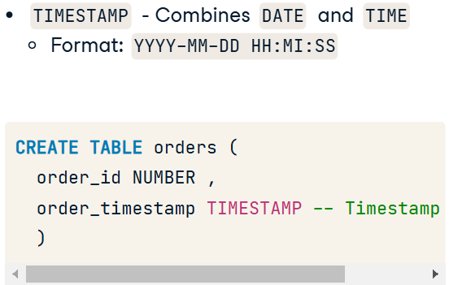

### Data type conversion
Data type conversion, as the name suggests, involves changing data from one type to another. For example, if we've stored order_quantity as text, we can transform it into the appropriate type, such as a number, with data type conversion. 

- A prime reason is performance. For instance, storing a number as text hampers computations and slows queries.
- Storing data in its correct format readies it for immediate use, ensuring accuracy.
- Proper data conversion not only prevents errors but also maintains the reliability of the data. A consistent and accurate dataset is always of higher quality.

Snowflake provides various methods for data type conversion One way is to use the CAST function. We use keyword CAST, then enclose the source data or column name and the desired target data type, separated by the AS keyword. 
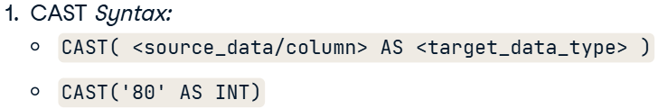

Alternatively, we can achieve the exact conversion using the double colon operator positioned directly after the source data or column. 
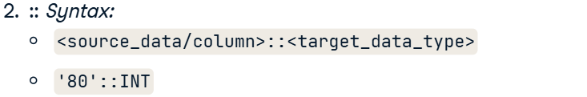

Let's take another casting example. We're converting the order_date column into a TIMESTAMP format. Once converted, the time defaults to "00" because original data doesn't specify any time details. 
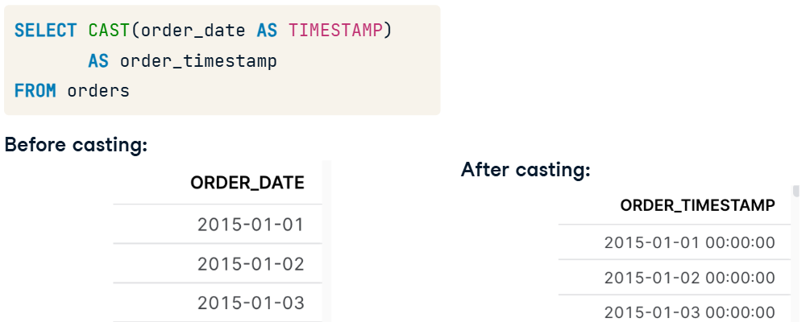

Snowflake provides a range of conversion functions like TO_VARCHAR, TO_DATE, and others for specific conversions. Among these, we will particularly focus on TO_DATE here. It converts expressions, like a string or a timestamp, into a date format by extracting the date component from the given timestamp. As shown here, TO_DATE keyword is used with timestamp; the result, extracted date. 
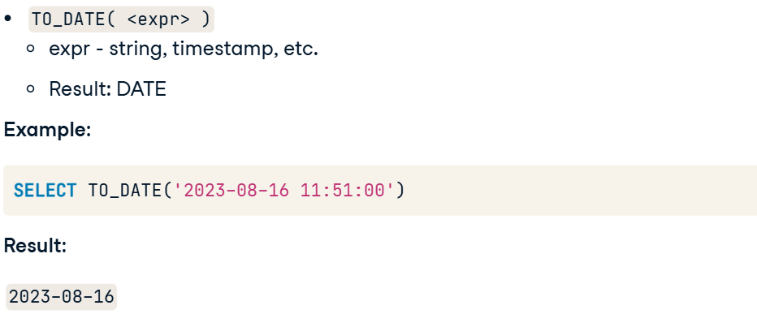

## Joining in Snowflake
### Natural Joins
Moving on to NATURAL JOIN. Unlike standard joins, NATURAL JOINs eliminate duplicate columns by automatically matching columns with the same name. 
NATURAL JOIN can also be combined with OUTER JOIN, and notice there is no ON clause in this join. 

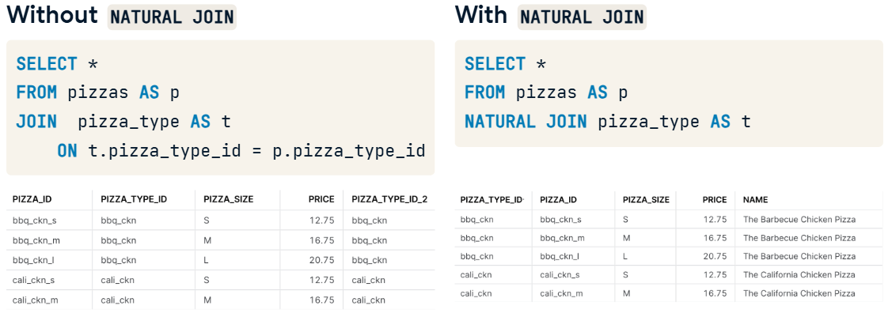

For instance, pizza_type_id could appear twice, with the second labeled as pizza_type_id_2. NATURAL JOIN avoids this by automatically matching same-named columns across tables, such as pizza_type_id, eliminating duplicates and the need for an ON clause. 
`So, it's convenient for quickly matching columns with the same name between tables without explicitly stating the matching conditions.`

### Lateral Joins
LATERAL allows a subquery within the FROM clause to access columns from a preceding table or view. 
So, when we use 'LATERAL', the right-hand subquery can reference columns from the left-hand table, making our queries more dynamic.  

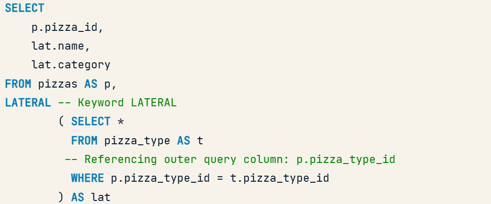

### Common Table Expressions (CTEs)
When subqueries get complex with many conditions, we need a cleaner and more flexible approach. This is where Common Table Expressions, or CTEs, come in handy. 
CTEs are like giving a nickname to a query so we can easily use it in a query. Once it's named, we can refer to it just like any other table. 

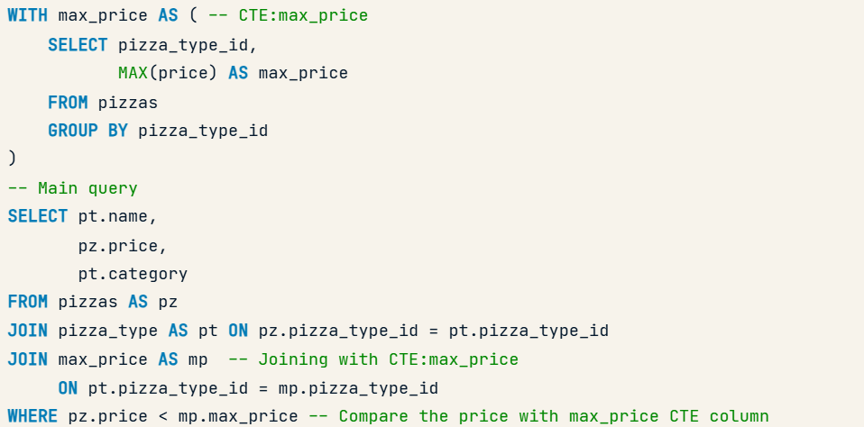

`In CTEs, we're not limited to just one; we can use multiple in a single query. Each CTE, like cte1 and cte2 here, separated by a comma, serves its own purpose and can be incorporated into the main query.`

## Handling Semi-structured Data
The VARIANT data type supports both object and array data. An object contains key-value pairs, while an array is an ordered list of values. 

### Semi-structured data functions
#### PARSE_JSON
One such function is PARSE_JSON. This function converts JSON-formatted strings into a VARIANT type, returning a valid JSON object, simplifying how we store and query JSON. 

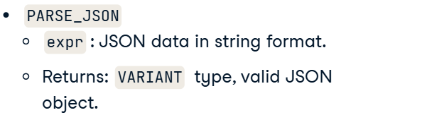 
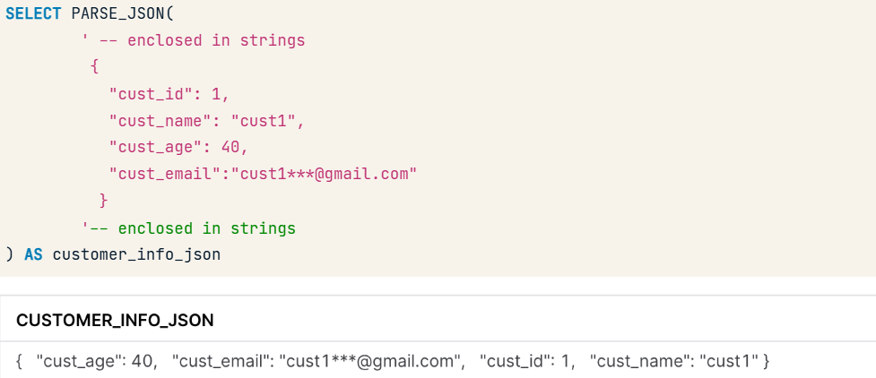

#### OBJECT_CONSTRUCT
Another useful function is `OBJECT_CONSTRUCT`, which takes key-value pairs and returns a JSON object. 

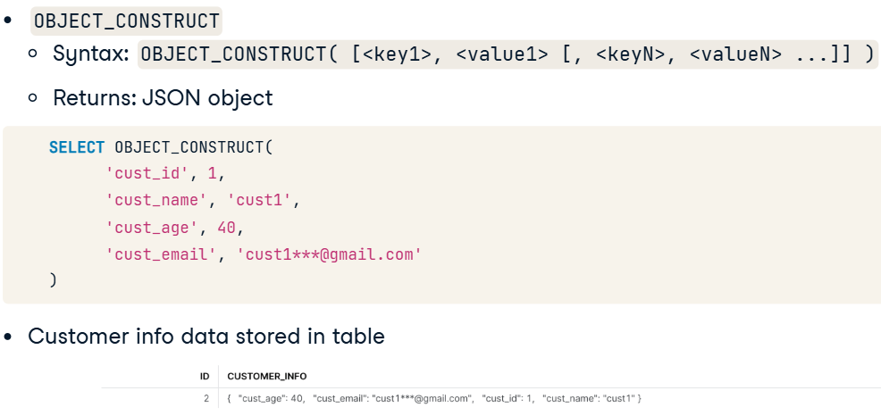

### Querying JSON data
We'll begin with a basic JSON format and query it from the table. Snowflake provides a colon notation to retrieve values from specific keys. 

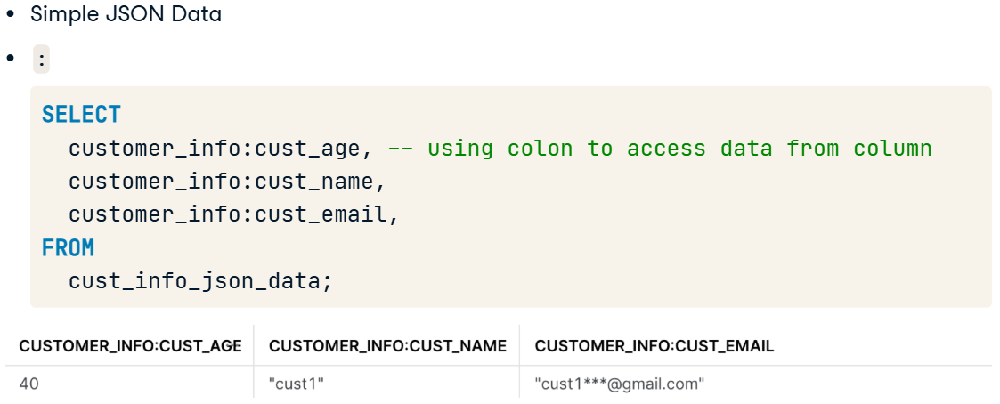

Here, the address shows nested properties like street, city and state. To query these values from the nested "address", Snowflake provides notations like the colon and the dot notation. 

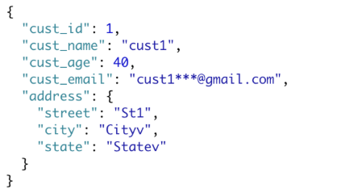

Colons separate each level of the nested JSON structure in colon notation. For instance, we can use the given query to access the street name nested under the 'address' key in the 'customer_info' column. Alternatively, dot notation starts with a colon for the first level and uses dots for subsequent levels, like we have separated address and street with a dot. The end result is the same. 

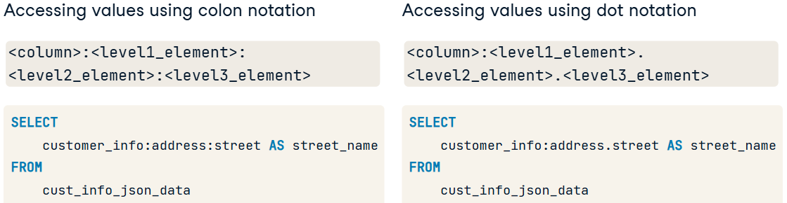