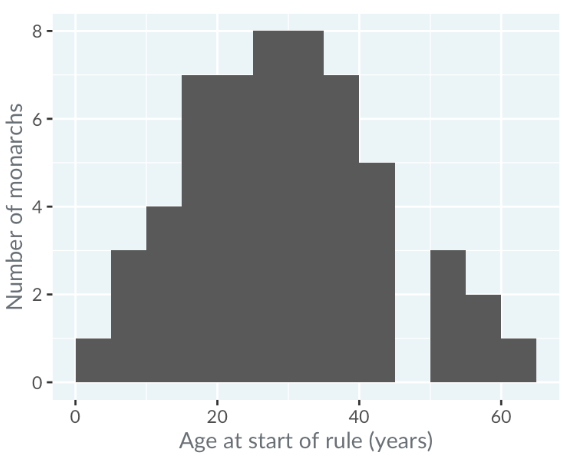
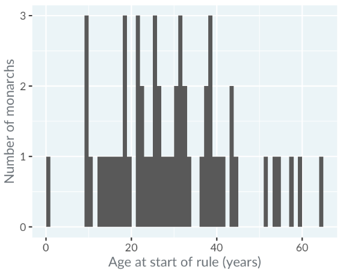
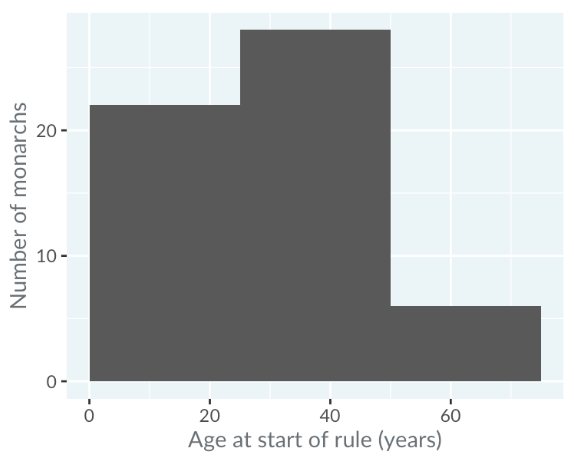
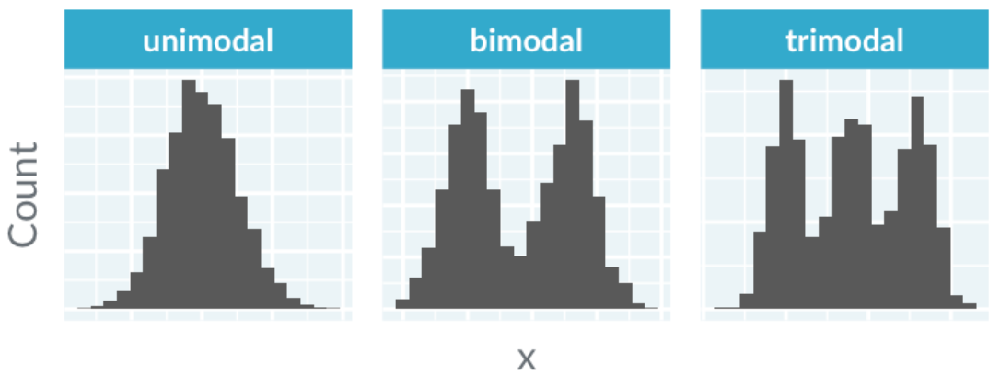
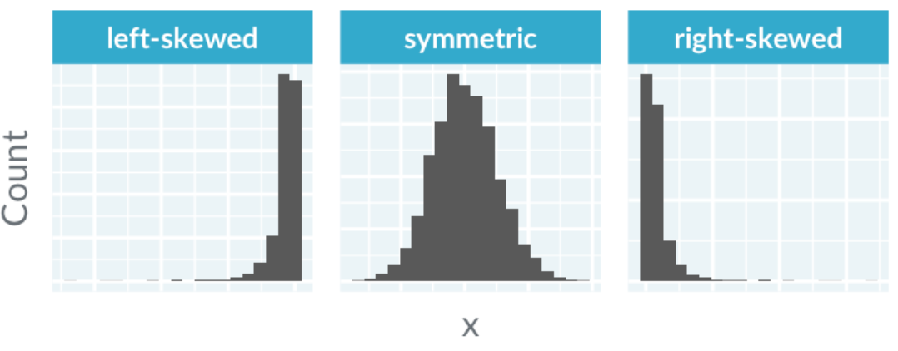
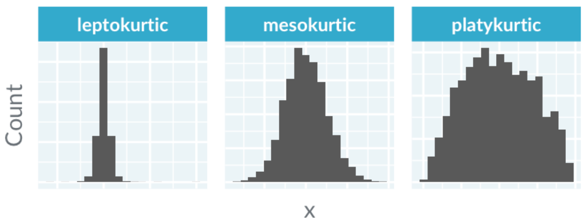
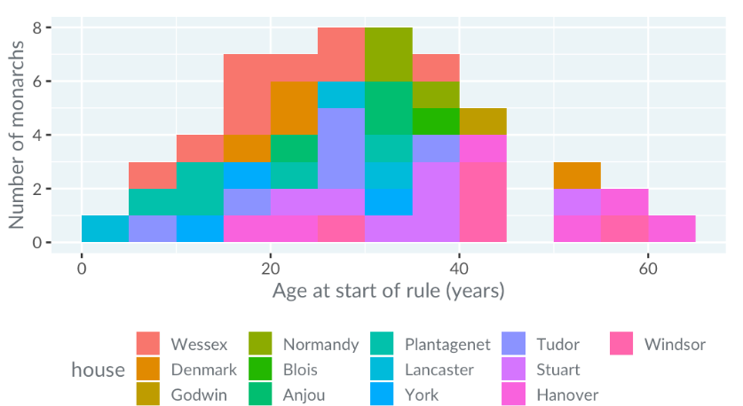
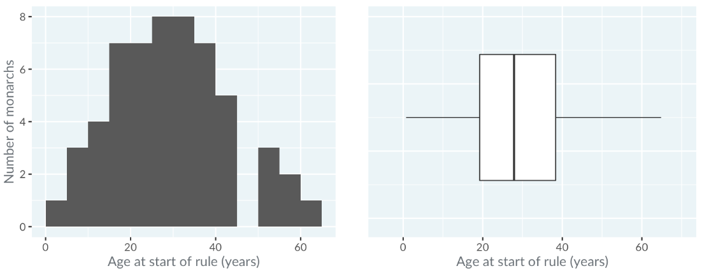
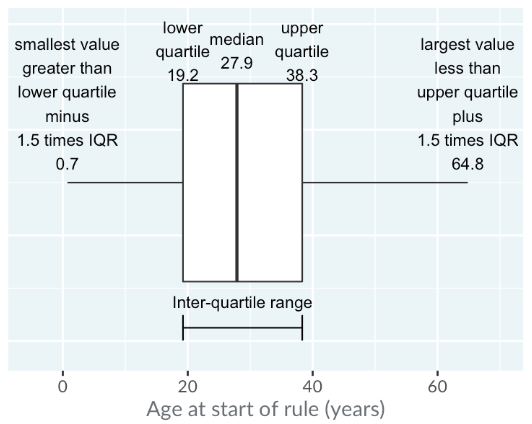
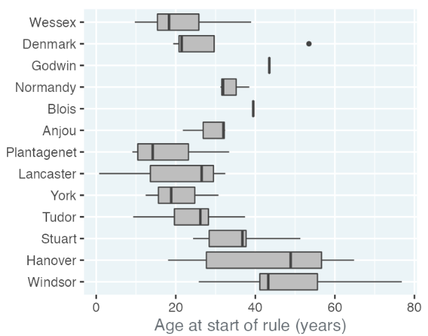

# Unedrstanding Data Visualization
## Three ways of getting insights
1. Firstly, you can calculate summary statistics. That includes measures of quantity like **mean** or **median**, and measures of variation like **standard deviation**.
2. Secondly, you can run statistical models like **linear and logistic regression** to model relationships between variables.
3. Thirdly, you can visualize data by drawing plots like a **scatter**, **bar** or a **histogram**.

In this course, we'll focus in on the third way. 

#### Choosing a type of plot depends on whether your variables are continuous or categorical.
- **Continuous** variables are **numbers**, such as heights, or temperatures or revenues. You can do arithmetic on continuous variables, like adding two temperatures together.
- **Categorical** variables are things that can be classified, and are **usually written as text**. They include eye color, which takes the categories blue, brown and a few others. Other examples include country and industry, which have a longer list of categories.

#### Finally, some things can either be continuous or categorical.
- Age is a number, so by default it's a continuous variable. However, many surveys use age groups like 25 to 30.
- time is naturally a continuous variable, but if you have to produce a report on how prices change each month, you might want to think of the month of the year as a categorical variable.

## Histograms
Histograms are a type of plot that takes **one continuous variable** as its input. It allows you to answer questions about the **shape** of that variable's distribution.

The x-axis is the variable that we are interested in - the ages. These ages are grouped into "bins", that is, intervals. 
In this case, the bins are zero to five years, five to ten years, and so on up to sixty to sixty five years. 

The y-axis is the count of monarchs who began ruling when they were in each age bin. 
For example, four monarchs began ruling when they were between ten and fifteen years old. Straight away, you can see that there have been no monarchs who started ruling when they were between the ages of forty five and fifty.

`this would be a unimodal, symetric, slightly platykurtic histogram.`

- The appearance of a histogram is strongly influenced by the choice of binwidth. This is the same histogram as before, but with the binwidth changed from five years to one year. 
It's difficult to get much insight into the distribution, because the counts are very noisy. 
 
`Choosing a binwidth that is too wide also causes problems.` 

- By changing the binwidth to twenty five years, you don't see any detail in the distribution, and again it is hard to get much insight. In general, it is difficult to know the best binwidth before you draw the plot, so you'll need to experiment with several values. 

 
 
 

### Modality
When interpreting histograms, the first thing to look at is the modality of the distribution. That is, how many peaks there are. A distribution with one peak is called "unimodal"; a distribution with two peaks is called "bimodal", and so on.

### Skewness
The second thing to look at is the skewness of the distribution. 
A left-skewed distribution has outliers, that is, the extreme values, on the left, and a right-skewed distribution has outliers on the right. 

### Kurtosis
One more advanced thing you can look at is the kurtosis of the distribution, which affects the number of outliers. 

- A mesokurtic distribution is something that looks like the bell curve from a normal distribution.
- A leptokurtic distribution has a narrow peak and lots of extreme values. Leptokurtic distributions are important in finance, because weird stuff happens in stock markets more often than the normal distribution would predict.
- A platykurtic distribution has a broad peak and few extreme values.

## Box Plots
Let's revisit the kings and queens dataset. Suppose we want to see the distribution of ages for each royal house. A naive solution might be to draw the same histogram, but using different colors for each house. Sadly, this is a horrible muddled mess. 

Box plots split a continuous variable - like age - by a categorical variable - like royal house - and allow us to compare the resulting distributions in a space-efficient way. 
Here's a comparison of the histogram you saw before with a box plot. 

- The line in the middle shows the median of the distribution. That is, half the monarchs started ruling before this age, and half after this age.
- The box in the box plot extends from the lower quartile to the upper quartile.
    - The lower quartile is the point where one quarter of the values are below it. That is, one quarter of the monarchs started ruling before this age, and three quarters after it.
    - Likewise, the upper quartile is the age where three quarters of the monarchs started ruling below this age.
    - The difference between the upper quartile and the lower quartile is called the **inter-quartile range**.
- The horizontal lines, known as "whiskers", have a more complicated definition. Each bar extends to one and a half times the interquartile range, but then they are limited to reaching actual data points.  
` In practice, you can think of the whiskers as extending far enough that anything outside of them is an extreme value.` 

 
 

As mentioned before, the power of box plots is that you can compare many distributions at once. Here, the royal houses are ordered from oldest at the top to newest at the bottom. A trend is visible: since the Plantagenets in the fourteenth century, the boxes gradually move right showing that the ages when new monarchs ascend to the throne have been increasing. Godwin and Blois appear as a single line because there was only one king from each house. The Anjou house only had three kings, and forms a box with one whisker, not two.

`Notice that the box plot for the house of Denmark shows a point. Points are extreme values, that is, values that are outside the range of the whiskers. Denmark's right-most outlier is Sweyn who ascended at age 53, which was exceptionally high for the 11th century.`