# Unedrstanding Data Visualization
## Three ways of getting insights
1. Firstly, you can calculate summary statistics. That includes measures of quantity like **mean** or **median**, and measures of variation like **standard deviation**.
2. Secondly, you can run statistical models like **linear and logistic regression** to model relationships between variables.
3. Thirdly, you can visualize data by drawing plots like a **scatter**, **bar** or a **histogram**.

In this course, we'll focus in on the third way. 

#### Choosing a type of plot depends on whether your variables are continuous or categorical.
- **Continuous** variables are **numbers**, such as heights, or temperatures or revenues. You can do arithmetic on continuous variables, like adding two temperatures together.
- **Categorical** variables are things that can be classified, and are **usually written as text**. They include eye color, which takes the categories blue, brown and a few others. Other examples include country and industry, which have a longer list of categories.

#### Finally, some things can either be continuous or categorical.
- Age is a number, so by default it's a continuous variable. However, many surveys use age groups like 25 to 30.
- time is naturally a continuous variable, but if you have to produce a report on how prices change each month, you might want to think of the month of the year as a categorical variable.

## Histograms
Histograms are a type of plot that takes **one continuous variable** as its input. It allows you to answer questions about the **shape** of that variable's distribution.

The x-axis is the variable that we are interested in - the ages. These ages are grouped into "bins", that is, intervals. 
In this case, the bins are zero to five years, five to ten years, and so on up to sixty to sixty five years. 

The y-axis is the count of monarchs who began ruling when they were in each age bin. 
For example, four monarchs began ruling when they were between ten and fifteen years old. Straight away, you can see that there have been no monarchs who started ruling when they were between the ages of forty five and fifty.

`this would be a unimodal, symetric, slightly platykurtic histogram.`

- The appearance of a histogram is strongly influenced by the choice of binwidth. This is the same histogram as before, but with the binwidth changed from five years to one year. 
It's difficult to get much insight into the distribution, because the counts are very noisy. 
 
`Choosing a binwidth that is too wide also causes problems.` 

- By changing the binwidth to twenty five years, you don't see any detail in the distribution, and again it is hard to get much insight. In general, it is difficult to know the best binwidth before you draw the plot, so you'll need to experiment with several values. 

 
 
 

### Modality
When interpreting histograms, the first thing to look at is the modality of the distribution. That is, how many peaks there are. A distribution with one peak is called "unimodal"; a distribution with two peaks is called "bimodal", and so on.

### Skewness
The second thing to look at is the skewness of the distribution. 
A left-skewed distribution has outliers, that is, the extreme values, on the left, and a right-skewed distribution has outliers on the right. 

### Kurtosis
One more advanced thing you can look at is the kurtosis of the distribution, which affects the number of outliers. 

- A mesokurtic distribution is something that looks like the bell curve from a normal distribution.
- A leptokurtic distribution has a narrow peak and lots of extreme values. Leptokurtic distributions are important in finance, because weird stuff happens in stock markets more often than the normal distribution would predict.
- A platykurtic distribution has a broad peak and few extreme values.

## Box Plots
Let's revisit the kings and queens dataset. Suppose we want to see the distribution of ages for each royal house. A naive solution might be to draw the same histogram, but using different colors for each house. Sadly, this is a horrible muddled mess. 

Box plots split a continuous variable - like age - by a categorical variable - like royal house - and allow us to compare the resulting distributions in a space-efficient way. 
Here's a comparison of the histogram you saw before with a box plot. 

- The line in the middle shows the median of the distribution. That is, half the monarchs started ruling before this age, and half after this age.
- The box in the box plot extends from the lower quartile to the upper quartile.
    - The lower quartile is the point where one quarter of the values are below it. That is, one quarter of the monarchs started ruling before this age, and three quarters after it.
    - Likewise, the upper quartile is the age where three quarters of the monarchs started ruling below this age.
    - The difference between the upper quartile and the lower quartile is called the **inter-quartile range**.
- The horizontal lines, known as "whiskers", have a more complicated definition. Each bar extends to one and a half times the interquartile range, but then they are limited to reaching actual data points.  
` In practice, you can think of the whiskers as extending far enough that anything outside of them is an extreme value.` 

 
 

As mentioned before, the power of box plots is that you can compare many distributions at once. Here, the royal houses are ordered from oldest at the top to newest at the bottom. A trend is visible: since the Plantagenets in the fourteenth century, the boxes gradually move right showing that the ages when new monarchs ascend to the throne have been increasing. Godwin and Blois appear as a single line because there was only one king from each house. The Anjou house only had three kings, and forms a box with one whisker, not two.

`Notice that the box plot for the house of Denmark shows a point. Points are extreme values, that is, values that are outside the range of the whiskers. Denmark's right-most outlier is Sweyn who ascended at age 53, which was exceptionally high for the 11th century.`

## Scatter Plots
Scatter plots should be used when you have **two continuous variables**, and you want to know about their relationship.

One important concept when interpreting scatter plots is the idea of **correlation**.  
Roughly speaking, correlation is a **measure of how well you can draw a straight line** through the points. 
If that straight line goes upwards as you move to the right, it's called a positive correlation. If the line goes down as you go to the right, it's called negative correlation.

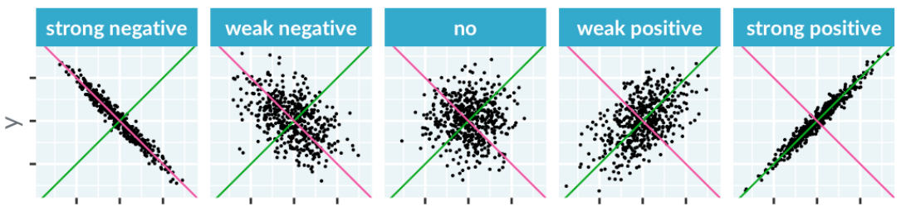

Correlation makes the most sense if there is a straight line relationship between the x and y values. If you have a more complicated shape, you'll need to be more creative in how you describe the relationship.

Adding a straight line to a scatter plot is a great way to see you if you really do have a linear relationship between the x and y variables. Here, with the logarithmic scales, the trend line has a close fit to the points, suggesting that as the logarithm of the area increases, you get a linear increase in the logarithm of the price.

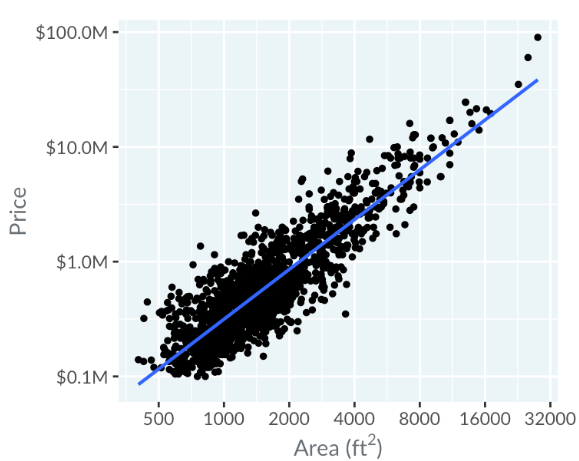

Sometimes a straight line might be a terrible fit. Here, in the price versus area plot using a linear scale, the line completely misses the more expensive homes. When a straight trend line is a poor fit, one alternative is to use a curve. Having a curve like this can help you find a way to describe the relationship. Here, by seeing the trend line curve upwards, you can say "as area increases, the price increases faster than linearly".

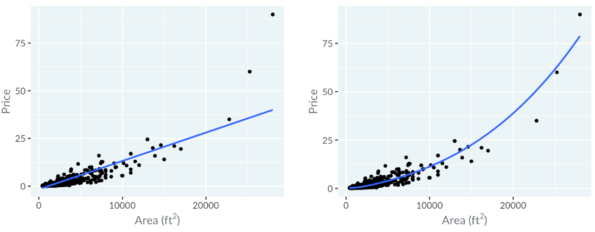

## Line Plots
the use case for line plots is the same as for scatter plots, with one extra condition: consecutive data points are connected in some way. 
The most common case is that the x-axis represents dates or times, like you just saw with the coronavirus cases, but that isn't always the case.

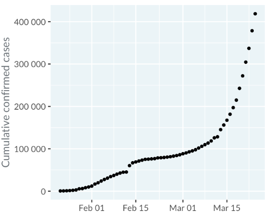

One really useful thing about line plots is that you can draw multiple lines on the same plot and compare them. Here you can see that in February, the majority of cases of COVID-19 were reported in China, then in March the rest of the world overtook it.

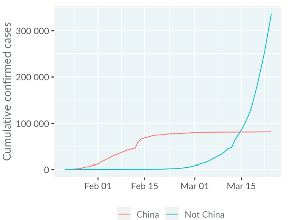

One useful thing to do is to compare line plots to a trend line generated from a linear regression. This plot shows the cases reported in China in March, after quarantines and other restrictions were in place. The data line closely follows the straight trend line, indicating that the number of cases is growing linearly.

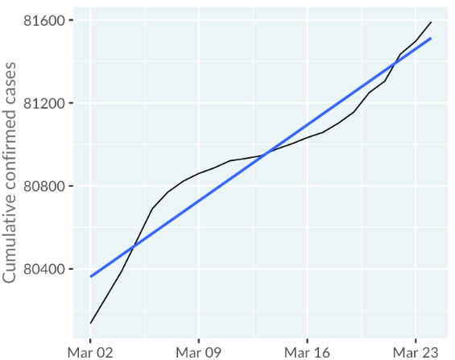

By contrast, if we look at the cases outside of China, a linear trend is a really poor fit. The number of cases is growing much faster than that. 
By transforming the plot to use a logarithmic scale on the y-axis before fitting the trend line, you see a much better fit. That means that on a worldwide level, the number of cases is growing exponentially.

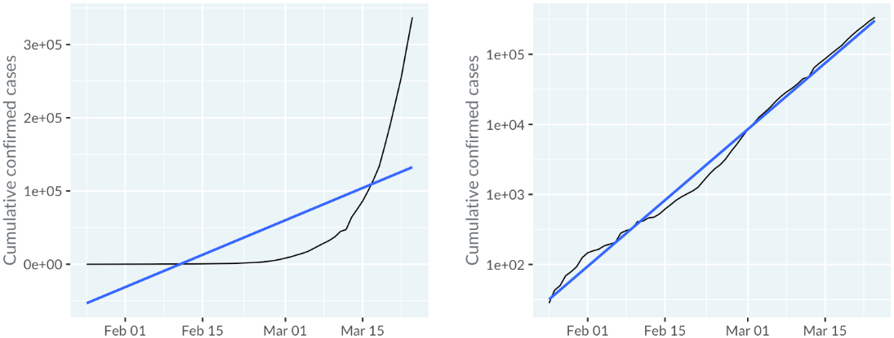

Just because you have a dataset where you want to look at the relationship between a numeric variable and time, it doesn't mean a line plot is the best choice. Here you can see the results of a poll by the BBC, where critics were asked to score the best hip-hop songs. In the plot, each point represents a song. Date is on the x-axis and the critic's score is on the y-axis. Because each song is not connected to the next song, you can't draw a line between them, and a scatter plot makes more sense. To reiterate: **line plots need consecutive data values to be conceptually connected**.

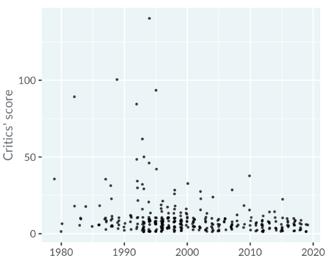

Conversely, you don't always need dates or times on the x-axis. Here you can see a plot of juvenile offenders in Switzerland. The x-axis is time, and the y-axis is the number of offenders, and each line represents an age group. Somehow, I find this plot be be very unsatisfying for getting insights. In a later exercise, you'll see an alternative approach without a time x-axis that works better.

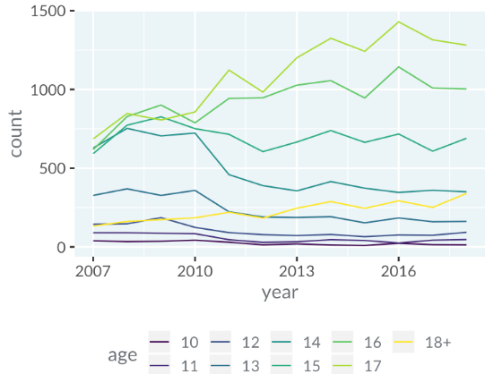

## Bar Plots
Bar plots are a close relative of box plots.  
They are usually used when you **want counts or percentages of a categorical variable**. 
Though less common, it is possible to calculate a different number for each category. 
An important constraint is that the value **zero should be important** in some way, since the bars extend to zero.

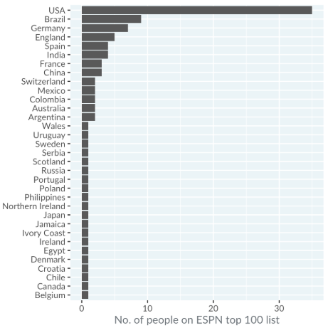

`Usually, you'll want to sort the bars by the count. This makes it easier to see that, for example, Spain and India are tied for fifth place, with four athletes each.`

Since the percentages of children for each year always add up to 100%, it's helpful to stack the bars on top of each other. 
In 2003, the UK government started a campaign to encourage people to eat five portions of fruit and veggies per day. Look at the bottom blocks, and notice that the percentage of children eating five portions increased each year from 2003 to 2006, and stayed roughly constant until 2014. 
Similarly, the pale blocks at the top of the plot show that the percentage of children eating zero portions per day decreased from 2003 to 2006 then stayed constant. It looks like the campaign was a success. 

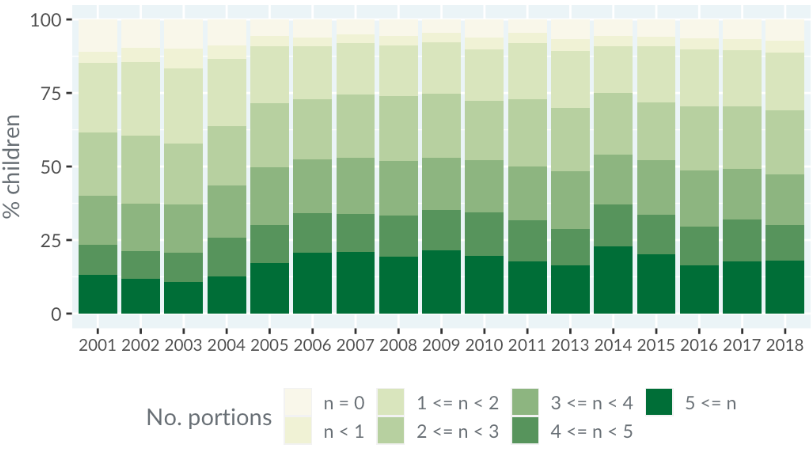 
`If you care about percentages rather than counts, then stacked bar plots are often a good choice of plot.`

Here are the box plots of the age that English and British monarchs started ruling, split by royal house. 
A bar plot of counts by house has a similar form: the categories are on the y-axis, and the x-axis is numeric. 
The difference is that the box plot is designed to answer questions about the spread of a variable, and the bar plot is designed to answer questions about a single metric relative to zero, in this case count. 

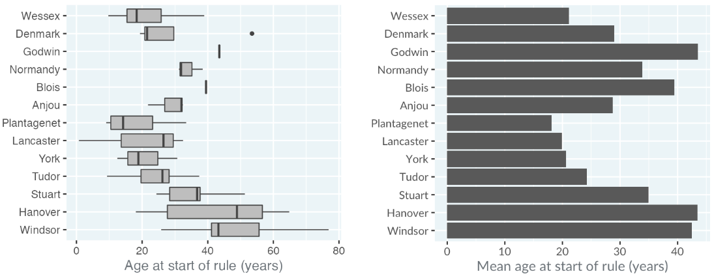

## Dot Plots
Dot plots work in the same situations as bar plots, but have two advantages. 
You can use a logarithmic scale with them, and you can plot multiple metrics with them.

Here is a dot plot of the social media followings of the ESPN 2017 top 100 famous athletes, with one row per athlete. Three metrics are shown for each athlete: the number of followers on Facebook, Instagram, and Twitter. Only the athletes for Basketball, Cricket, Soccer, and Tennis who had accounts on each platform are shown. Rows are sorted alphabetically for each sport.

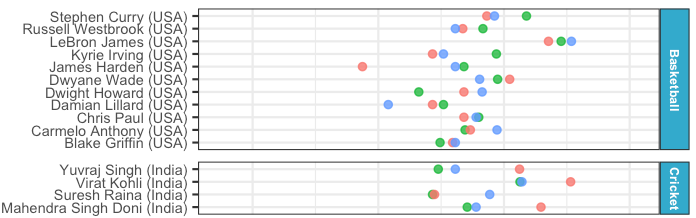

